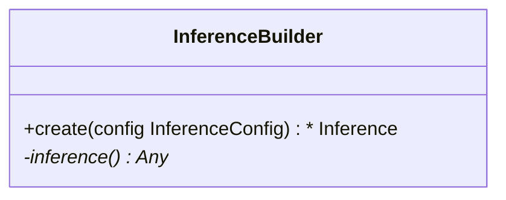

This tutorial can be downloaded as part of the [Wallaroo Tutorials repository](https://github.com/WallarooLabs/Wallaroo_Tutorials/tree/main/pipeline-edge-publish/edge-arbitrary-python).

## Arbitrary Python Tutorial Deploy Model in Wallaroo Upload and Deploy

This tutorial demonstrates how to use arbitrary python as a ML Model in Wallaroo and deploy the pipeline, then deploy that same pipeline to edge devices through an Open Container Initiative Registry, registered in the Wallaroo instance as the Edge Deployment Registry.

### Tutorial Goals

* **Arbitrary Python Tutorial Deploy Model in Wallaroo Upload and Deploy**: Deploys the `KMeans` model in an arbitrary Python package in Wallaroo, and perform sample inferences.  The file `models/model-auto-conversion-BYOP-vgg16-clustering.zip` is provided so users can go right to testing deployment.
* **Publish pipeline to Open Container Initiative Registry, registered in the Wallaroo instance as the Edge Deployment Registry.**:  This will containerize the pipeline and copy the engine, python steps, model, and deployment configuration to the registry service.
* **Deploy the Pipeline to an Edge Device**:  The pipeline will be deployed to an Edge device through Docker.

### Tutorial Prerequisites

* A Wallaroo version 2023.3.0 or above instance.

### References

* [Wallaroo SDK Essentials Guide: Model Uploads and Registrations: Arbitrary Python](https://docs.wallaroo.ai/wallaroo-developer-guides/wallaroo-sdk-guides/wallaroo-sdk-essentials-guide/wallaroo-sdk-model-uploads/wallaroo-sdk-model-arbitrary-python/)

Arbitrary Python models, also known as Bring Your Own Predict (BYOP) allow for custom model deployments with supporting scripts and artifacts.  These are used with pre-trained models (PyTorch, Tensorflow, etc) along with whatever supporting artifacts they require.  Supporting artifacts can include other Python modules, model files, etc.  These are zipped with all scripts, artifacts, and a `requirements.txt` file that indicates what other Python models need to be imported that are outside of the typical Wallaroo platform.

Contrast this with Wallaroo Python models - aka "Python steps".  These are standalone python scripts that use the python libraries natively supported by the Wallaroo platform.  These are used for either simple model deployment (such as ARIMA Statsmodels), or data formatting such as the postprocessing steps.  A Wallaroo Python model will be composed of one Python script that matches the Wallaroo requirements.

## Arbitrary Python File Requirements

Arbitrary Python (BYOP) models are uploaded to Wallaroo via a ZIP file with the following components:

| Artifact | Type | Description |
|---|---|---|
| Python scripts aka `.py` files with classes that extend `mac.inference.Inference` and `mac.inference.creation.InferenceBuilder` | Python Script | Extend the classes `mac.inference.Inference` and `mac.inference.creation.InferenceBuilder`.  These are included with the [Wallaroo SDK](https://docs.wallaroo.ai/wallaroo-developer-guides/wallaroo-sdk-guides/#data-type-conditions).  Further details are in [Arbitrary Python Script Requirements](https://docs.wallaroo.ai/wallaroo-developer-guides/wallaroo-sdk-guides/wallaroo-sdk-essentials-guide/wallaroo-sdk-model-uploads/wallaroo-sdk-model-arbitrary-python/).  Note that there is no specified naming requirements for the classes that extend `mac.inference.Inference` and `mac.inference.creation.InferenceBuilder` - any qualified class name is sufficient as long as these two classes are extended as defined below. |
| `requirements.txt` | Python requirements file | This sets the Python libraries used for the arbitrary python model.  These libraries should be targeted for Python 3.8 compliance.  **These requirements and the versions of libraries should be exactly the same between creating the model and deploying it in Wallaroo**.  This insures that the script and methods will function exactly the same as during the model creation process. |
| Other artifacts | Files | Other models, files, and other artifacts used in support of this model. |

For example, the if the arbitrary python model will be known as `vgg_clustering`, the contents may be in the following structure, with `vgg_clustering` as the storage directory:

```bash
vgg_clustering\
    feature_extractor.h5
    kmeans.pkl
    custom_inference.py
    requirements.txt
```

Note the inclusion of the `custom_inference.py` file.  This file name is **not** required - any Python script or scripts that extend the classes listed above are sufficient.  This Python script could have been named `vgg_custom_model.py` or any other name as long as it includes the extension of the classes listed above.

The sample arbitrary python model file is  created with the command `zip -r vgg_clustering.zip vgg_clustering/`.

Wallaroo Arbitrary Python uses the Wallaroo SDK `mac` module, included in the Wallaroo SDK 2023.2.1 and above.  See the [Wallaroo SDK Install Guides](https://docs.wallaroo.ai/wallaroo-developer-guides/wallaroo-sdk-guides/wallaroo-sdk-install-guides/) for instructions on installing the Wallaroo SDK.

### Arbitrary Python Script Requirements

The entry point of the arbitrary python model is *any* python script that extends the following classes.  These are included with the [Wallaroo SDK](https://docs.wallaroo.ai/wallaroo-developer-guides/wallaroo-sdk-guides/wallaroo-sdk-install-guides/).  The required methods that must be overridden are specified in each section below.

* `mac.inference.Inference` interface serves model inferences based on submitted input some input. Its purpose is to serve inferences for any supported arbitrary model framework (e.g. `scikit`, `keras` etc.).

  ```mermaid
  classDiagram
      class Inference {
          <<Abstract>>
          +model Optional[Any]
          +expected_model_types()* Set
          +predict(input_data: InferenceData)*  InferenceData
          -raise_error_if_model_is_not_assigned() None
          -raise_error_if_model_is_wrong_type() None
      }
  ```

* `mac.inference.creation.InferenceBuilder` builds a concrete `Inference`, i.e. instantiates an `Inference` object, loads the appropriate model and assigns the model to to the Inference object.

  ```mermaid
  classDiagram
      class InferenceBuilder {
          +create(config InferenceConfig) * Inference
          -inference()* Any
      }
  ```

### mac.inference.Inference

#### mac.inference.Inference Objects

| Object | Type | Description |
|---|---|---|
| `model Optional[Any]` | An optional list of models that match the supported frameworks from `wallaroo.framework.Framework` included in the arbitrary python script.  Note that this is **optional** - no models are actually required.  A BYOP can refer to a specific model(s) used, be used for data processing and reshaping for later pipeline steps, or other needs. |

#### mac.inference.Inference Methods

| Method | Returns | Description |
|---|---|---|
| `expected_model_types` (*Required*) | `Set` | Returns a Set of models expected for the inference as defined by the developer.  Typically this is a set of one.  Wallaroo checks the expected model types to verify that the model submitted through the `InferenceBuilder` method matches what this `Inference` class expects. |
| `_predict (input_data: mac.types.InferenceData)` (*Required*) |  `mac.types.InferenceData` | The entry point for the Wallaroo inference with the following input and output parameters that are defined when the model is updated. <ul><li>`mac.types.InferenceData`: The **input** `InferenceData` is a dictionary of numpy arrays derived from the `input_schema` detailed when the model is uploaded, defined in PyArrow.Schema format.</li><li>`mac.types.InferenceData`:  The **output** is a dictionary of numpy arrays as defined by the output paraemters defined in PyArrow.Schema format.</li></ul>  The `InferenceDataValidationError` exception is raised when the input data does not match `mac.types.InferenceData`. |
| `raise_error_if_model_is_not_assigned` | N/A | Error when `expected_model_types` is not set. |
| `raise_error_if_model_is_wrong_type` | N/A | Error when the model does not match the `expected_model_types`. |

### mac.inference.creation.InferenceBuilder

`InferenceBuilder` builds a concrete `Inference`, i.e. instantiates an `Inference` object, loads the appropriate model and assigns the model to the Inference.



**Each model** that is included requires its own `InferenceBuilder`.  `InferenceBuilder` loads one model, then submits it to the `Inference` class when created.  The `Inference` class checks this class against its `expected_model_types()` Set.

#### mac.inference.creation.InferenceBuilder Methods

| Method | Returns | Description |
|---|---|---|
| `create(config mac.config.inference.CustomInferenceConfig)` (*Required*) |  The custom `Inference` instance. | Creates an Inference subclass, then assigns a model and attributes.  The `CustomInferenceConfig` is used to retrieve the `config.model_path`, which is a `pathlib.Path object` pointing to the folder where the model artifacts are saved.  **Every** artifact loaded must be relative to `config.model_path`.  This is set when the arbitrary python .zip file is uploaded and the environment for running it in Wallaroo is set.  For example:  loading the artifact `vgg_clustering\feature_extractor.h5` would be set with `config.model_path \ feature_extractor.h5`.  The model loaded must match an existing module.  For our example, this is `from sklearn.cluster import KMeans`, and this must match the `Inference` `expected_model_types`.  |
| `inference` | custom `Inference` instance. | Returns the instantiated custom Inference object created from the `create` method. |

## Tutorial Steps

### Import Libraries

The first step is to import the libraries we'll be using.  These are included by default in the Wallaroo instance's JupyterHub service.

```python
import numpy as np
import pandas as pd
import json
import pyarrow as pa
import wallaroo

from wallaroo.pipeline   import Pipeline
from wallaroo.deployment_config import DeploymentConfigBuilder
from wallaroo.framework import Framework
from wallaroo.object import EntityNotFoundError

import requests
```

### Open a Connection to Wallaroo

The next step is connect to Wallaroo through the Wallaroo client.  The Python library is included in the Wallaroo install and available through the Jupyter Hub interface provided with your Wallaroo environment.

This is accomplished using the `wallaroo.Client()` command, which provides a URL to grant the SDK permission to your specific Wallaroo environment.  When displayed, enter the URL into a browser and confirm permissions.  Store the connection into a variable that can be referenced later.

If logging into the Wallaroo instance through the internal JupyterHub service, use `wl = wallaroo.Client()`.  If logging in externally, update the `wallarooPrefix` and `wallarooSuffix` variables with the proper DNS information.  For more information on Wallaroo DNS settings, see the [Wallaroo DNS Integration Guide](https://docs.wallaroo.ai/wallaroo-operations-guide/wallaroo-configuration/wallaroo-dns-guide/).

```python
wl = wallaroo.Client()
```

### Set Variables and Helper Functions

We'll set the name of our workspace, pipeline, models and files.  Workspace names must be unique across the Wallaroo workspace.  For this, we'll add in a randomly generated 4 characters to the workspace name to prevent collisions with other users' workspaces.  If running this tutorial, we recommend hard coding the workspace name so it will function in the same workspace each time it's run.

We'll set up some helper functions that will either use existing workspaces and pipelines, or create them if they do not already exist.

```python
import string
import random

# make a random 4 character suffix to prevent overwriting other user's workspaces
suffix= ''.join(random.choice(string.ascii_lowercase) for i in range(4))

suffix='john'

workspace_name = f'vgg16-clustering-workspace{suffix}'
pipeline_name = f'vgg16-clustering-pipeline'

model_name = 'vgg16-clustering'
model_file_name = './models/model-auto-conversion-BYOP-vgg16-clustering.zip'
```

```python
def get_workspace(name):
    workspace = None
    for ws in wl.list_workspaces():
        if ws.name() == name:
            workspace= ws
    if(workspace == None):
        workspace = wl.create_workspace(name)
    return workspace

def get_pipeline(name):
    try:
        pipeline = wl.pipelines_by_name(name)[0]
    except EntityNotFoundError:
        pipeline = wl.build_pipeline(name)
    return pipeline
```

### Create Workspace and Pipeline

We will now create the Wallaroo workspace to store our model and set it as the current workspace.  Future commands will default to this workspace for pipeline creation, model uploads, etc.  We'll create our Wallaroo pipeline that is used to deploy our arbitrary Python model.

```python
workspace = get_workspace(workspace_name)
wl.set_current_workspace(workspace)

pipeline = get_pipeline(pipeline_name)
```

### Upload Arbitrary Python Model

Arbitrary Python models are uploaded to Wallaroo through the Wallaroo Client `upload_model` method.

#### Upload Arbitrary Python Model Parameters

The following parameters are required for Arbitrary Python models.  Note that while some fields are considered as **optional** for the `upload_model` method, they are required for proper uploading of a Arbitrary Python model to Wallaroo.

| Parameter | Type | Description |
|---|---|---|
|`name` | `string` (*Required*) | The name of the model.  Model names are unique per workspace.  Models that are uploaded with the same name are assigned as a new **version** of the model. |
|`path` | `string` (*Required*) | The path to the model file being uploaded. |
|`framework` |`string` (*Upload Method Optional, Arbitrary Python model Required*) | Set as `Framework.CUSTOM`. |
|`input_schema` | `pyarrow.lib.Schema` (*Upload Method Optional, Arbitrary Python model Required*) | The input schema in Apache Arrow schema format. |
|`output_schema` | `pyarrow.lib.Schema` (*Upload Method Optional, Arbitrary Python model Required*) | The output schema in Apache Arrow schema format. |
| `convert_wait` | `bool` (*Upload Method Optional, Arbitrary Python model Optional*) (*Default: True*) | <ul><li>**True**: Waits in the script for the model conversion completion.</li><li>**False**:  Proceeds with the script without waiting for the model conversion process to display complete. |

Once the upload process starts, the model is containerized by the Wallaroo instance.  This process may take up to 10 minutes.

#### Upload Arbitrary Python Model Return

The following is returned with a successful model upload and conversion.

| Field | Type | Description |
|---|---|---|
| `name` | string | The name of the model. |
| `version` | string | The model version as a unique UUID. |
| `file_name` | string | The file name of the model as stored in Wallaroo. |
| `image_path` | string | The image used to deploy the model in the Wallaroo engine. |
| `last_update_time` | DateTime | When the model was last updated. |

For our example, we'll start with setting the `input_schema` and `output_schema` that is expected by our `ImageClustering._predict()` method.

```python
input_schema = pa.schema([
    pa.field('images', pa.list_(
        pa.list_(
            pa.list_(
                pa.int64(),
                list_size=3
            ),
            list_size=32
        ),
        list_size=32
    )),
])

output_schema = pa.schema([
    pa.field('predictions', pa.int64()),
])
```

### Upload Model

Now we'll upload our model.  The framework is `Framework.CUSTOM` for arbitrary Python models, and we'll specify the input and output schemas for the upload.

```python
model = wl.upload_model(model_name, 
                        model_file_name, 
                        framework=Framework.CUSTOM, 
                        input_schema=input_schema, 
                        output_schema=output_schema, 
                        convert_wait=True)
model
```

    Waiting for model loading - this will take up to 10.0min.
    Model is pending loading to a container runtime...
    Model is attempting loading to a container runtime.....................successful
    
    Ready

<table>
        <tr>
          <td>Name</td>
          <td>vgg16-clustering</td>
        </tr>
        <tr>
          <td>Version</td>
          <td>220e1d9f-0f7f-4647-8aff-6968755b5f3c</td>
        </tr>
        <tr>
          <td>File Name</td>
          <td>model-auto-conversion-BYOP-vgg16-clustering.zip</td>
        </tr>
        <tr>
          <td>SHA</td>
          <td>7bb3362b1768c92ea7e593451b2b8913d3b7616c19fd8d25b73fb6990f9283e0</td>
        </tr>
        <tr>
          <td>Status</td>
          <td>ready</td>
        </tr>
        <tr>
          <td>Image Path</td>
          <td>proxy.replicated.com/proxy/wallaroo/ghcr.io/wallaroolabs/mlflow-deploy:v2023.3.0-3798</td>
        </tr>
        <tr>
          <td>Updated At</td>
          <td>2023-19-Sep 19:18:56</td>
        </tr>
      </table>

### Deploy Pipeline

The model is uploaded and ready for use.  We'll add it as a step in our pipeline, then deploy the pipeline.  For this example we're allocated 0.25 cpu and 4 Gi RAM to the pipeline through the pipeline's deployment configuration.

```python
pipeline.add_model_step(model)
```

<table><tr><th>name</th> <td>vgg16-clustering-pipeline</td></tr><tr><th>created</th> <td>2023-09-08 14:52:44.325178+00:00</td></tr><tr><th>last_updated</th> <td>2023-09-08 14:56:09.249050+00:00</td></tr><tr><th>deployed</th> <td>False</td></tr><tr><th>tags</th> <td></td></tr><tr><th>versions</th> <td>50d6586a-0661-4f26-802d-c71da2ceea2e, d94e44b3-7ff6-4138-8b76-be1795cb6690, 8d2a8143-2255-408a-bd09-e3008a5bde0b</td></tr><tr><th>steps</th> <td>vgg16-clustering</td></tr><tr><th>published</th> <td>True</td></tr></table>

```python
deployment_config = DeploymentConfigBuilder() \
    .cpus(1).memory('4Gi') \
    .build()

pipeline.deploy(deployment_config=deployment_config)
pipeline.status()
```

    {'status': 'Running',
     'details': [],
     'engines': [{'ip': '10.244.3.202',
       'name': 'engine-76955445fb-bbff5',
       'status': 'Running',
       'reason': None,
       'details': [],
       'pipeline_statuses': {'pipelines': [{'id': 'vgg16-clustering-pipeline',
          'status': 'Running'}]},
       'model_statuses': {'models': [{'name': 'vgg16-clustering',
          'version': '220e1d9f-0f7f-4647-8aff-6968755b5f3c',
          'sha': '7bb3362b1768c92ea7e593451b2b8913d3b7616c19fd8d25b73fb6990f9283e0',
          'status': 'Running'}]}}],
     'engine_lbs': [{'ip': '10.244.4.236',
       'name': 'engine-lb-584f54c899-cfvmf',
       'status': 'Running',
       'reason': None,
       'details': []}],
     'sidekicks': [{'ip': '10.244.3.203',
       'name': 'engine-sidekick-vgg16-clustering-53-86b66d46d8-r9qq8',
       'status': 'Running',
       'reason': None,
       'details': [],
       'statuses': '\n'}]}

### Run inference

Everything is in place - we'll now run a sample inference with some toy data.  In this case we're randomly generating some values in the data shape the model expects, then submitting an inference request through our deployed pipeline.

```python
deploy_url = pipeline._deployment._url()

headers = wl.auth.auth_header()

headers['Content-Type']='application/json; format=pandas-records'
headers['Accept']='application/json; format=pandas-records'

dataFile = './data/vgg16_test.df.json'
```

```python
# inference through Pipeline Deploy URL

!curl -X POST {deploy_url} \
     -H "Authorization:{headers['Authorization']}" \
     -H "Content-Type:{headers['Content-Type']}" \
     -H "Accept:{headers['Accept']}" \
     --data @{dataFile}
```

    [{"time":1695151217023,"in":{"images":[23,109,44,60,212,137,45,255,159,203,92,99,75,244,173,169,213,186,247,81,161,135,206,44,150,191,1,73,60,210,61,198,189,3,27,29,225,138,32,184,1,88,137,36,207,149,212,226,114,173,4,68,226,177,254,75,105,51,29,168,119,230,221,128,1,135,104,246,46,164,69,120,21,98,143,173,113,167,100,71,128,119,162,98,191,108,102,103,180,246,155,13,9,214,67,7,81,189,166,182,5,229,242,143,42,237,179,142,116,51,0,205,150,204,43,173,219,249,105,105,234,196,132,45,195,248,208,135,154,254,5,244,48,169,227,9,164,72,92,36,203,162,165,155,64,77,242,110,14,44,238,197,203,159,190,205,9,6,247,34,58,38,171,237,228,15,244,79,147,97,81,199,251,244,89,156,154,96,125,45,91,26,147,40,186,91,252,213,113,13,168,130,61,217,10,252,115,167,163,66,246,98,24,120,46,255,249,56,37,65,222,206,185,39,54,154,26,123,93,95,38,34,197,24,149,212,120,170,87,11,1,29,84,244,101,117,51,53,196,8,201,127,232,117,128,63,138,60,59,65,25,153,160,52,21,251,186,63,143,36,196,128,136,206,31,249,122,70,167,245,78,144,245,0,19,186,116,222,120,28,237,6,102,158,203,113,89,224,161,51,114,26,172,231,70,213,42,217,101,79,246,79,177,137,195,222,25,213,162,87,185,109,225,137,97,149,195,31,57,135,127,76,163,246,180,106,93,29,182,189,244,251,2,227,118,72,183,129,203,161,105,124,156,212,30,167,250,225,3,164,70,41,212,171,60,26,5,6,98,218,120,113,11,231,0,167,136,34,142,59,166,198,118,130,15,169,158,235,117,0,70,246,131,85,171,206,220,202,153,45,252,136,123,210,163,177,60,118,124,138,53,255,126,26,173,121,45,115,103,202,108,176,47,93,85,159,133,145,11,190,73,191,106,89,46,63,164,142,5,26,150,140,167,62,128,71,170,2,145,173,113,18,125,70,15,179,121,165,176,120,84,249,1,104,15,75,99,15,249,114,8,103,18,191,30,108,243,145,26,4,173,231,254,120,220,8,8,110,244,71,91,154,85,251,101,90,68,52,12,209,8,15,84,103,136,32,189,187,34,58,220,168,188,51,134,16,172,107,243,162,181,29,91,109,56,4,177,179,55,147,29,139,161,7,181,161,24,211,247,102,117,213,222,71,26,23,196,111,164,200,97,60,163,229,9,38,44,9,214,36,7,149,112,21,84,223,41,133,75,35,189,144,67,43,199,38,4,168,70,219,73,195,115,95,80,120,128,247,115,46,184,4,211,115,49,99,147,145,10,10,168,32,101,116,181,128,56,17,133,185,13,39,109,230,239,65,142,235,6,74,13,55,208,239,104,171,117,40,59,182,150,184,97,4,197,206,227,24,188,246,108,37,68,221,217,69,142,113,220,147,51,47,146,194,127,67,99,145,176,86,129,54,237,143,86,209,116,209,235,24,59,134,69,67,95,130,227,150,93,187,230,119,85,132,50,41,203,148,182,221,186,113,214,105,38,154,134,177,117,228,144,233,76,61,223,6,142,187,129,56,208,152,86,206,28,180,172,66,40,102,162,107,219,34,87,241,165,73,160,175,158,33,67,34,155,250,173,231,250,18,227,67,251,21,208,116,198,135,143,133,99,176,227,106,62,145,161,152,39,105,56,185,111,234,225,28,188,142,251,164,205,68,249,235,54,246,63,11,124,158,58,31,189,137,49,229,59,68,143,85,114,79,9,131,16,113,114,91,93,248,20,225,159,94,237,130,117,129,79,50,176,104,76,27,254,148,155,41,143,148,117,159,44,57,15,252,120,183,245,104,247,130,3,72,69,195,41,24,180,73,243,148,16,241,8,102,115,223,161,138,102,9,1,15,97,206,71,238,164,174,11,30,184,216,62,255,118,7,97,185,59,96,72,26,130,127,104,143,211,67,191,81,99,164,231,67,142,84,140,96,19,98,155,143,72,178,101,181,131,113,16,239,117,111,207,91,162,145,68,52,163,146,216,212,29,146,46,206,116,235,12,80,75,156,236,11,146,235,10,195,150,91,107,47,194,237,198,157,166,29,194,202,13,95,151,232,20,180,10,65,224,84,127,218,60,153,74,44,180,217,203,159,220,250,36,137,212,242,47,239,188,44,195,131,233,233,55,146,7,95,105,12,50,246,130,146,112,205,36,18,92,209,85,210,94,181,73,4,212,233,205,89,249,239,50,254,92,39,73,69,251,255,100,15,99,147,226,59,2,100,214,219,43,107,100,99,60,210,178,78,131,208,144,28,213,49,180,59,86,214,20,10,45,22,45,39,18,61,47,207,101,174,161,58,126,212,109,87,199,92,134,100,73,139,137,71,46,20,177,28,86,172,221,79,121,147,252,219,215,139,213,197,197,9,171,160,202,3,55,134,151,116,16,79,229,18,182,134,197,219,169,53,230,36,65,109,254,84,163,100,81,31,130,63,188,15,126,129,99,100,134,43,23,92,48,100,102,126,215,144,48,157,31,125,232,183,192,174,51,98,231,165,73,81,104,91,164,3,75,108,170,138,115,210,155,183,142,200,176,223,138,120,104,239,85,62,147,53,50,130,25,9,118,64,21,90,134,33,5,143,240,203,38,229,23,116,120,240,119,237,123,58,111,34,9,156,181,118,194,212,155,35,242,72,13,57,22,63,179,154,129,168,79,197,200,186,58,67,91,187,91,66,72,47,189,214,253,230,167,90,0,70,190,149,19,64,94,195,6,230,110,177,190,13,173,91,82,142,172,205,7,56,249,77,243,141,189,12,88,65,251,175,4,191,203,110,102,39,95,173,207,167,209,26,255,22,131,163,239,215,200,137,190,226,209,185,236,104,242,255,64,1,200,119,42,59,65,206,57,107,21,90,20,87,145,158,221,62,124,81,214,129,138,72,104,174,177,210,246,254,242,58,119,73,53,142,91,173,40,56,155,5,90,51,55,163,60,187,152,13,85,50,82,223,51,184,92,175,31,239,238,72,43,243,134,248,77,247,220,35,136,147,228,79,141,21,162,18,186,213,74,13,133,63,113,167,97,156,68,200,61,35,22,78,138,123,184,232,139,194,59,252,94,161,34,60,74,136,116,182,7,7,146,182,222,0,153,51,207,146,198,83,44,82,238,38,204,65,240,200,200,245,205,209,124,64,241,21,50,97,12,151,139,115,242,44,205,26,44,96,153,183,60,195,78,216,155,147,137,71,99,193,91,76,42,206,166,86,77,38,25,79,35,216,85,92,218,148,255,76,150,65,139,109,69,53,4,245,169,169,34,240,228,54,135,126,174,178,61,190,165,118,16,195,71,89,251,247,77,115,150,151,72,18,0,204,198,80,253,15,56,227,9,142,246,142,164,237,202,5,153,231,92,131,11,125,100,174,162,194,238,110,143,127,198,55,3,210,24,54,33,210,239,63,184,170,45,202,39,172,68,231,93,76,233,73,83,178,249,43,78,19,93,195,144,96,152,31,34,25,71,154,143,119,253,113,98,130,97,161,173,173,152,17,77,130,118,21,163,189,59,135,68,59,173,208,79,47,145,46,136,255,198,243,57,88,222,3,52,250,84,126,176,67,239,1,43,87,156,93,166,98,24,141,220,145,54,214,201,138,68,69,150,167,14,205,4,194,13,66,174,128,109,235,203,139,135,85,0,105,249,100,205,89,250,207,204,129,16,194,9,134,72,5,184,246,122,139,98,50,149,152,174,50,97,114,231,100,16,74,31,73,248,11,30,150,233,170,160,170,74,207,46,99,183,247,222,103,107,186,226,174,36,63,17,234,107,148,6,35,104,193,136,88,51,204,222,142,109,57,4,6,108,180,125,219,113,53,228,149,168,142,198,4,206,195,183,231,94,78,87,184,178,227,106,112,70,136,51,68,50,238,130,231,236,117,154,241,13,16,217,125,110,147,188,31,184,8,60,30,147,233,202,244,192,46,2,25,155,11,169,32,217,130,112,137,128,114,5,148,73,47,97,199,157,226,210,211,73,223,242,19,72,237,184,238,185,79,167,47,163,98,115,190,28,209,221,173,243,172,197,45,28,39,81,76,34,216,200,28,76,167,79,241,53,227,208,11,16,194,21,244,165,210,168,168,104,219,235,199,143,152,193,226,232,209,57,82,103,135,24,252,15,215,80,136,190,147,29,107,57,226,213,56,170,202,97,22,185,34,186,89,152,234,87,52,223,194,88,90,104,82,18,167,55,254,249,222,195,130,109,54,162,5,45,7,233,46,150,166,201,221,135,209,162,182,91,107,42,196,40,192,84,248,191,84,166,176,6,212,149,138,170,59,90,68,200,245,59,243,164,1,210,83,177,182,120,18,200,157,226,81,241,124,151,79,126,216,153,137,20,241,182,249,231,241,81,6,226,129,24,53,81,100,238,162,31,235,67,132,106,57,163,28,178,143,62,9,182,154,5,243,83,170,19,126,140,36,216,245,22,188,91,243,127,117,39,167,133,134,186,253,247,46,198,135,232,92,251,200,9,247,126,223,142,190,206,111,9,96,73,149,129,32,99,20,61,67,182,238,234,9,203,57,228,144,138,133,137,94,214,175,226,112,48,69,130,37,78,142,124,25,79,72,30,94,251,84,93,34,32,156,139,174,6,37,133,179,112,128,130,46,13,121,148,33,121,62,30,48,114,56,132,146,180,92,140,3,82,104,138,232,20,128,81,118,182,174,113,30,106,224,107,146,38,218,236,6,42,187,228,253,18,137,32,243,129,30,78,5,190,16,84,75,232,116,193,87,206,187,185,28,234,218,59,93,173,99,228,108,44,150,185,238,86,78,162,254,133,98,112,202,205,96,145,169,5,227,231,160,140,84,69,38,95,146,238,245,96,237,204,210,45,186,200,184,32,68,224,76,65,205,146,18,74,134,42,226,171,138,62,205,104,200,202,192,26,37,30,210,157,202,21,72,138,198,107,81,177,243,33,226,91,82,210,52,110,124,38,229,54,247,157,238,14,244,149,85,22,168,163,98,165,31,181,174,170,34,50,235,120,88,24,100,214,153,64,154,98,139,10,74,33,93,68,203,254,53,221,201,147,36,180,157,77,52,102,239,32,62,243,50,28,222,25,16,93,185,92,194,10,192,130,126,165,193,71,108,234,210,111,151,54,91,8,150,95,253,199,138,76,98,22,211,217,120,190,198,74,9,221,135,69,240,56,246,227,158,89,114,212,154,188,190,119,144,71,137,1,186,217,56,29,108,63,208,104,79,28,208,164,37,126,170,50,52,48,154,135,57,4,204,61,95,230,149,147,26,88,80,95,194,37,195,250,1,116,121,174,53,101,197,89,95,23,143,27,181,188,133,247,36,106,237,55,194,135,39,243,119,139,190,128,143,255,51,60,54,255,71,87,16,146,11,106,87,167,78,63,217,68,128,156,66,94,118,158,140,9,247,161,197,229,5,89,41,35,188,132,225,34,32,228,149,210,244,154,218,0,215,192,4,206,1,169,113,208,90,36,238,137,104,61,10,196,109,33,53,46,84,114,195,225,52,235,205,193,157,21,38,111,94,26,243,113,44,41,67,42,195,221,189,72,58,201,222,182,223,128,124,158,28,35,212,76,237,202,6,252,240,235,23,56,123,155,62,71,198,52,114,70,218,100,141,5,187,0,251,121,117,17,19,158,29,209,76,160,155,182,61,142,108,178,238,151,24,49,89,170,196,137,177,191,107,25,70,66,244,243,100,31,88,225,244,5,244,193,166,123,115,174,38,122,239,169,146,229,228,41,241,12,89,235,196,187,21,87,199,234,165,125,102,136,76,38,208,10,234,171,80,126,152,252,68,36,3,12,108,112,236,159,10,148,8,173,212,129,110,173,136,187,236,60,61,209,131,251,218,20,216,116,23,43,195,193,156,183,37,11,1,11,223,241,26,13,169,23,66,139,208,62,76,149,84,133,217,119,254,247,187,217,76,252,82,94,82,20,220,170,177,245,1,93,50,173,110,150,17,16,52,79,16,54,102,1,184,138,50,100,92,84,39,213,66,203,255,114,143,65,149,244,19,175,223,248,46,191,149,45,159,161,239,59,146,4,56,57,199,160,234,230,2,26,98,234,190,143,30,4,206,160,150,142,5,238,131,198,113,107,41,242,240,96,44,199,149,0,57,55,142,87,248,190,109,252,107,114,244,185,5,42,234,144,193,20,19,78,237,191,132,189,205,242,245,225,31,130,247,31,222,155,24,81,66,64,86,17,241,161,209,237,128,251,66,2,80,241,148,40,133,246,28,215,7,79,112,200,252,109,73,251,157,210,59,90,213,40,32,110,65,0,90,96,124,255,244,174,20,252,58,81,233,61,213,222,191,216,156,238,18,204,76,212,238,74,222,92,231,251,14,234,16,244,180,15,42,160,245,37,142,242,34,16,203,21,233,205,188,2,217,7,237,111,16,135,232,210,223,3,143,57,88,241,14,47,187,219,197,51,211,29,145,32,85,184,210,137,155,235,47,138,6,23,156,238,168,216,61,217,48,11,96,227,213,5,235,222,228,196,23,1,124,51,105,60,115,216,8,175,156,178,75,216,234,9,40,154,230,128,88,58,130,197,254,122,8,82,254,255,250,243,225,232,77,48,17,228,59,0,140,36,216,158,100,160,246,53,3,87,222,231,112,121,227,138,108,9,119,235,203,78,123,191,250,126,2,107,17,34,229,181,201,206,213,106,166,154,173,175,233,191,95,43,204,177,239,21,74,79,144,150,208,65,188,24,185,98,77,25,126,93,177,69,255,172,166,193,102,139,6,241,95,250,173,9,60,95,27,190,158,170,248,16,104,23,250,154,153,111,159,184,17,93,100,113,136,248,246,203,50,210,21,136,114,39,137,120,71,9,130,195,13,165,11,236,142,142,114,99,168,195,57]},"out":{"predictions":1},"check_failures":[],"metadata":{"last_model":"{\"model_name\":\"vgg16-clustering\",\"model_sha\":\"7bb3362b1768c92ea7e593451b2b8913d3b7616c19fd8d25b73fb6990f9283e0\"}","pipeline_version":"","elapsed":[1638122,161056622],"dropped":[]}},{"time":1695151217023,"in":{"images":[23,109,44,60,212,137,45,255,159,203,92,99,75,244,173,169,213,186,247,81,161,135,206,44,150,191,1,73,60,210,61,198,189,3,27,29,225,138,32,184,1,88,137,36,207,149,212,226,114,173,4,68,226,177,254,75,105,51,29,168,119,230,221,128,1,135,104,246,46,164,69,120,21,98,143,173,113,167,100,71,128,119,162,98,191,108,102,103,180,246,155,13,9,214,67,7,81,189,166,182,5,229,242,143,42,237,179,142,116,51,0,205,150,204,43,173,219,249,105,105,234,196,132,45,195,248,208,135,154,254,5,244,48,169,227,9,164,72,92,36,203,162,165,155,64,77,242,110,14,44,238,197,203,159,190,205,9,6,247,34,58,38,171,237,228,15,244,79,147,97,81,199,251,244,89,156,154,96,125,45,91,26,147,40,186,91,252,213,113,13,168,130,61,217,10,252,115,167,163,66,246,98,24,120,46,255,249,56,37,65,222,206,185,39,54,154,26,123,93,95,38,34,197,24,149,212,120,170,87,11,1,29,84,244,101,117,51,53,196,8,201,127,232,117,128,63,138,60,59,65,25,153,160,52,21,251,186,63,143,36,196,128,136,206,31,249,122,70,167,245,78,144,245,0,19,186,116,222,120,28,237,6,102,158,203,113,89,224,161,51,114,26,172,231,70,213,42,217,101,79,246,79,177,137,195,222,25,213,162,87,185,109,225,137,97,149,195,31,57,135,127,76,163,246,180,106,93,29,182,189,244,251,2,227,118,72,183,129,203,161,105,124,156,212,30,167,250,225,3,164,70,41,212,171,60,26,5,6,98,218,120,113,11,231,0,167,136,34,142,59,166,198,118,130,15,169,158,235,117,0,70,246,131,85,171,206,220,202,153,45,252,136,123,210,163,177,60,118,124,138,53,255,126,26,173,121,45,115,103,202,108,176,47,93,85,159,133,145,11,190,73,191,106,89,46,63,164,142,5,26,150,140,167,62,128,71,170,2,145,173,113,18,125,70,15,179,121,165,176,120,84,249,1,104,15,75,99,15,249,114,8,103,18,191,30,108,243,145,26,4,173,231,254,120,220,8,8,110,244,71,91,154,85,251,101,90,68,52,12,209,8,15,84,103,136,32,189,187,34,58,220,168,188,51,134,16,172,107,243,162,181,29,91,109,56,4,177,179,55,147,29,139,161,7,181,161,24,211,247,102,117,213,222,71,26,23,196,111,164,200,97,60,163,229,9,38,44,9,214,36,7,149,112,21,84,223,41,133,75,35,189,144,67,43,199,38,4,168,70,219,73,195,115,95,80,120,128,247,115,46,184,4,211,115,49,99,147,145,10,10,168,32,101,116,181,128,56,17,133,185,13,39,109,230,239,65,142,235,6,74,13,55,208,239,104,171,117,40,59,182,150,184,97,4,197,206,227,24,188,246,108,37,68,221,217,69,142,113,220,147,51,47,146,194,127,67,99,145,176,86,129,54,237,143,86,209,116,209,235,24,59,134,69,67,95,130,227,150,93,187,230,119,85,132,50,41,203,148,182,221,186,113,214,105,38,154,134,177,117,228,144,233,76,61,223,6,142,187,129,56,208,152,86,206,28,180,172,66,40,102,162,107,219,34,87,241,165,73,160,175,158,33,67,34,155,250,173,231,250,18,227,67,251,21,208,116,198,135,143,133,99,176,227,106,62,145,161,152,39,105,56,185,111,234,225,28,188,142,251,164,205,68,249,235,54,246,63,11,124,158,58,31,189,137,49,229,59,68,143,85,114,79,9,131,16,113,114,91,93,248,20,225,159,94,237,130,117,129,79,50,176,104,76,27,254,148,155,41,143,148,117,159,44,57,15,252,120,183,245,104,247,130,3,72,69,195,41,24,180,73,243,148,16,241,8,102,115,223,161,138,102,9,1,15,97,206,71,238,164,174,11,30,184,216,62,255,118,7,97,185,59,96,72,26,130,127,104,143,211,67,191,81,99,164,231,67,142,84,140,96,19,98,155,143,72,178,101,181,131,113,16,239,117,111,207,91,162,145,68,52,163,146,216,212,29,146,46,206,116,235,12,80,75,156,236,11,146,235,10,195,150,91,107,47,194,237,198,157,166,29,194,202,13,95,151,232,20,180,10,65,224,84,127,218,60,153,74,44,180,217,203,159,220,250,36,137,212,242,47,239,188,44,195,131,233,233,55,146,7,95,105,12,50,246,130,146,112,205,36,18,92,209,85,210,94,181,73,4,212,233,205,89,249,239,50,254,92,39,73,69,251,255,100,15,99,147,226,59,2,100,214,219,43,107,100,99,60,210,178,78,131,208,144,28,213,49,180,59,86,214,20,10,45,22,45,39,18,61,47,207,101,174,161,58,126,212,109,87,199,92,134,100,73,139,137,71,46,20,177,28,86,172,221,79,121,147,252,219,215,139,213,197,197,9,171,160,202,3,55,134,151,116,16,79,229,18,182,134,197,219,169,53,230,36,65,109,254,84,163,100,81,31,130,63,188,15,126,129,99,100,134,43,23,92,48,100,102,126,215,144,48,157,31,125,232,183,192,174,51,98,231,165,73,81,104,91,164,3,75,108,170,138,115,210,155,183,142,200,176,223,138,120,104,239,85,62,147,53,50,130,25,9,118,64,21,90,134,33,5,143,240,203,38,229,23,116,120,240,119,237,123,58,111,34,9,156,181,118,194,212,155,35,242,72,13,57,22,63,179,154,129,168,79,197,200,186,58,67,91,187,91,66,72,47,189,214,253,230,167,90,0,70,190,149,19,64,94,195,6,230,110,177,190,13,173,91,82,142,172,205,7,56,249,77,243,141,189,12,88,65,251,175,4,191,203,110,102,39,95,173,207,167,209,26,255,22,131,163,239,215,200,137,190,226,209,185,236,104,242,255,64,1,200,119,42,59,65,206,57,107,21,90,20,87,145,158,221,62,124,81,214,129,138,72,104,174,177,210,246,254,242,58,119,73,53,142,91,173,40,56,155,5,90,51,55,163,60,187,152,13,85,50,82,223,51,184,92,175,31,239,238,72,43,243,134,248,77,247,220,35,136,147,228,79,141,21,162,18,186,213,74,13,133,63,113,167,97,156,68,200,61,35,22,78,138,123,184,232,139,194,59,252,94,161,34,60,74,136,116,182,7,7,146,182,222,0,153,51,207,146,198,83,44,82,238,38,204,65,240,200,200,245,205,209,124,64,241,21,50,97,12,151,139,115,242,44,205,26,44,96,153,183,60,195,78,216,155,147,137,71,99,193,91,76,42,206,166,86,77,38,25,79,35,216,85,92,218,148,255,76,150,65,139,109,69,53,4,245,169,169,34,240,228,54,135,126,174,178,61,190,165,118,16,195,71,89,251,247,77,115,150,151,72,18,0,204,198,80,253,15,56,227,9,142,246,142,164,237,202,5,153,231,92,131,11,125,100,174,162,194,238,110,143,127,198,55,3,210,24,54,33,210,239,63,184,170,45,202,39,172,68,231,93,76,233,73,83,178,249,43,78,19,93,195,144,96,152,31,34,25,71,154,143,119,253,113,98,130,97,161,173,173,152,17,77,130,118,21,163,189,59,135,68,59,173,208,79,47,145,46,136,255,198,243,57,88,222,3,52,250,84,126,176,67,239,1,43,87,156,93,166,98,24,141,220,145,54,214,201,138,68,69,150,167,14,205,4,194,13,66,174,128,109,235,203,139,135,85,0,105,249,100,205,89,250,207,204,129,16,194,9,134,72,5,184,246,122,139,98,50,149,152,174,50,97,114,231,100,16,74,31,73,248,11,30,150,233,170,160,170,74,207,46,99,183,247,222,103,107,186,226,174,36,63,17,234,107,148,6,35,104,193,136,88,51,204,222,142,109,57,4,6,108,180,125,219,113,53,228,149,168,142,198,4,206,195,183,231,94,78,87,184,178,227,106,112,70,136,51,68,50,238,130,231,236,117,154,241,13,16,217,125,110,147,188,31,184,8,60,30,147,233,202,244,192,46,2,25,155,11,169,32,217,130,112,137,128,114,5,148,73,47,97,199,157,226,210,211,73,223,242,19,72,237,184,238,185,79,167,47,163,98,115,190,28,209,221,173,243,172,197,45,28,39,81,76,34,216,200,28,76,167,79,241,53,227,208,11,16,194,21,244,165,210,168,168,104,219,235,199,143,152,193,226,232,209,57,82,103,135,24,252,15,215,80,136,190,147,29,107,57,226,213,56,170,202,97,22,185,34,186,89,152,234,87,52,223,194,88,90,104,82,18,167,55,254,249,222,195,130,109,54,162,5,45,7,233,46,150,166,201,221,135,209,162,182,91,107,42,196,40,192,84,248,191,84,166,176,6,212,149,138,170,59,90,68,200,245,59,243,164,1,210,83,177,182,120,18,200,157,226,81,241,124,151,79,126,216,153,137,20,241,182,249,231,241,81,6,226,129,24,53,81,100,238,162,31,235,67,132,106,57,163,28,178,143,62,9,182,154,5,243,83,170,19,126,140,36,216,245,22,188,91,243,127,117,39,167,133,134,186,253,247,46,198,135,232,92,251,200,9,247,126,223,142,190,206,111,9,96,73,149,129,32,99,20,61,67,182,238,234,9,203,57,228,144,138,133,137,94,214,175,226,112,48,69,130,37,78,142,124,25,79,72,30,94,251,84,93,34,32,156,139,174,6,37,133,179,112,128,130,46,13,121,148,33,121,62,30,48,114,56,132,146,180,92,140,3,82,104,138,232,20,128,81,118,182,174,113,30,106,224,107,146,38,218,236,6,42,187,228,253,18,137,32,243,129,30,78,5,190,16,84,75,232,116,193,87,206,187,185,28,234,218,59,93,173,99,228,108,44,150,185,238,86,78,162,254,133,98,112,202,205,96,145,169,5,227,231,160,140,84,69,38,95,146,238,245,96,237,204,210,45,186,200,184,32,68,224,76,65,205,146,18,74,134,42,226,171,138,62,205,104,200,202,192,26,37,30,210,157,202,21,72,138,198,107,81,177,243,33,226,91,82,210,52,110,124,38,229,54,247,157,238,14,244,149,85,22,168,163,98,165,31,181,174,170,34,50,235,120,88,24,100,214,153,64,154,98,139,10,74,33,93,68,203,254,53,221,201,147,36,180,157,77,52,102,239,32,62,243,50,28,222,25,16,93,185,92,194,10,192,130,126,165,193,71,108,234,210,111,151,54,91,8,150,95,253,199,138,76,98,22,211,217,120,190,198,74,9,221,135,69,240,56,246,227,158,89,114,212,154,188,190,119,144,71,137,1,186,217,56,29,108,63,208,104,79,28,208,164,37,126,170,50,52,48,154,135,57,4,204,61,95,230,149,147,26,88,80,95,194,37,195,250,1,116,121,174,53,101,197,89,95,23,143,27,181,188,133,247,36,106,237,55,194,135,39,243,119,139,190,128,143,255,51,60,54,255,71,87,16,146,11,106,87,167,78,63,217,68,128,156,66,94,118,158,140,9,247,161,197,229,5,89,41,35,188,132,225,34,32,228,149,210,244,154,218,0,215,192,4,206,1,169,113,208,90,36,238,137,104,61,10,196,109,33,53,46,84,114,195,225,52,235,205,193,157,21,38,111,94,26,243,113,44,41,67,42,195,221,189,72,58,201,222,182,223,128,124,158,28,35,212,76,237,202,6,252,240,235,23,56,123,155,62,71,198,52,114,70,218,100,141,5,187,0,251,121,117,17,19,158,29,209,76,160,155,182,61,142,108,178,238,151,24,49,89,170,196,137,177,191,107,25,70,66,244,243,100,31,88,225,244,5,244,193,166,123,115,174,38,122,239,169,146,229,228,41,241,12,89,235,196,187,21,87,199,234,165,125,102,136,76,38,208,10,234,171,80,126,152,252,68,36,3,12,108,112,236,159,10,148,8,173,212,129,110,173,136,187,236,60,61,209,131,251,218,20,216,116,23,43,195,193,156,183,37,11,1,11,223,241,26,13,169,23,66,139,208,62,76,149,84,133,217,119,254,247,187,217,76,252,82,94,82,20,220,170,177,245,1,93,50,173,110,150,17,16,52,79,16,54,102,1,184,138,50,100,92,84,39,213,66,203,255,114,143,65,149,244,19,175,223,248,46,191,149,45,159,161,239,59,146,4,56,57,199,160,234,230,2,26,98,234,190,143,30,4,206,160,150,142,5,238,131,198,113,107,41,242,240,96,44,199,149,0,57,55,142,87,248,190,109,252,107,114,244,185,5,42,234,144,193,20,19,78,237,191,132,189,205,242,245,225,31,130,247,31,222,155,24,81,66,64,86,17,241,161,209,237,128,251,66,2,80,241,148,40,133,246,28,215,7,79,112,200,252,109,73,251,157,210,59,90,213,40,32,110,65,0,90,96,124,255,244,174,20,252,58,81,233,61,213,222,191,216,156,238,18,204,76,212,238,74,222,92,231,251,14,234,16,244,180,15,42,160,245,37,142,242,34,16,203,21,233,205,188,2,217,7,237,111,16,135,232,210,223,3,143,57,88,241,14,47,187,219,197,51,211,29,145,32,85,184,210,137,155,235,47,138,6,23,156,238,168,216,61,217,48,11,96,227,213,5,235,222,228,196,23,1,124,51,105,60,115,216,8,175,156,178,75,216,234,9,40,154,230,128,88,58,130,197,254,122,8,82,254,255,250,243,225,232,77,48,17,228,59,0,140,36,216,158,100,160,246,53,3,87,222,231,112,121,227,138,108,9,119,235,203,78,123,191,250,126,2,107,17,34,229,181,201,206,213,106,166,154,173,175,233,191,95,43,204,177,239,21,74,79,144,150,208,65,188,24,185,98,77,25,126,93,177,69,255,172,166,193,102,139,6,241,95,250,173,9,60,95,27,190,158,170,248,16,104,23,250,154,153,111,159,184,17,93,100,113,136,248,246,203,50,210,21,136,114,39,137,120,71,9,130,195,13,165,11,236,142,142,114,99,168,195,57]},"out":{"predictions":1},"check_failures":[],"metadata":{"last_model":"{\"model_name\":\"vgg16-clustering\",\"model_sha\":\"7bb3362b1768c92ea7e593451b2b8913d3b7616c19fd8d25b73fb6990f9283e0\"}","pipeline_version":"","elapsed":[1638122,161056622],"dropped":[]}}]

### Undeploy Pipelines

The inference is successful, so we will undeploy the pipeline and return the resources back to the cluster.

```python
pipeline.undeploy()
```

<table><tr><th>name</th> <td>vgg16-clustering-pipeline</td></tr><tr><th>created</th> <td>2023-09-08 14:52:44.325178+00:00</td></tr><tr><th>last_updated</th> <td>2023-09-19 19:19:03.122448+00:00</td></tr><tr><th>deployed</th> <td>False</td></tr><tr><th>tags</th> <td></td></tr><tr><th>versions</th> <td>7f6d902c-c264-401f-879c-c4a59997de70, 50d6586a-0661-4f26-802d-c71da2ceea2e, d94e44b3-7ff6-4138-8b76-be1795cb6690, 8d2a8143-2255-408a-bd09-e3008a5bde0b</td></tr><tr><th>steps</th> <td>vgg16-clustering</td></tr><tr><th>published</th> <td>True</td></tr></table>

### Publish the Pipeline for Edge Deployment

It worked! For a demo, we'll take working once as "tested". So now that we've tested our pipeline, we are ready to publish it for edge deployment.

Publishing it means assembling all of the configuration files and model assets and pushing them to an Open Container Initiative (OCI) repository set in the Wallaroo instance as the Edge Registry service.  DevOps engineers then retrieve that image and deploy it through Docker, Kubernetes, or similar deployments.

See [Edge Deployment Registry Guide](https://staging.docs.wallaroo.ai/wallaroo-operations-guide/wallaroo-configuration/wallaroo-edge-deployment/) for details on adding an OCI Registry Service to Wallaroo as the Edge Deployment Registry.

This is done through the SDK command `wallaroo.pipeline.publish(deployment_config)` which has the following parameters and returns.

#### Publish a Pipeline Parameters

The `publish` method takes the following parameters.  The containerized pipeline will be pushed to the Edge registry service with the model, pipeline configurations, and other artifacts needed to deploy the pipeline.

| Parameter | Type | Description |
|---|---|---|
| `deployment_config` | `wallaroo.deployment_config.DeploymentConfig` (*Optional*) | Sets the pipeline deployment configuration.  For example:    For more information on pipeline deployment configuration, see the [Wallaroo SDK Essentials Guide: Pipeline Deployment Configuration]().

#### Publish a Pipeline Returns

| Field | Type | Description |
|---|---|---|
| id | integer | Numerical Wallaroo id of the published pipeline. |
| pipeline version id | integer | Numerical Wallaroo id of the pipeline version published. |
| status | string | The status of the pipeline publication.  Values include:  <ul><li>PendingPublish: The pipeline publication is about to be uploaded or is in the process of being uploaded.</li><li>Published:  The pipeline is published and ready for use.</li></ul> |
| Engine URL | string | The URL of the published pipeline engine in the edge registry. |
| Pipeline URL | string | The URL of the published pipeline in the edge registry. |
| Helm Chart URL | string | The URL of the helm chart for the published pipeline in the edge registry. |
| Helm Chart Reference | string | The help chart reference. |
| Helm Chart Version | string | The version of the Helm Chart of the published pipeline.  This is also used as the Docker tag. |
| Engine Config | `wallaroo.deployment_config.DeploymentConfig` | The pipeline configuration included with the published pipeline. |
| Created At | DateTime | When the published pipeline was created. |
| Updated At | DateTime | When the published pipeline was updated. |

### Publish Example

We will now publish the pipeline to our Edge Deployment Registry with the `pipeline.publish(deployment_config)` command.  `deployment_config` is an optional field that specifies the pipeline deployment.  This can be overridden by the DevOps engineer during deployment.

```python
pub = pipeline.publish(deployment_config)
pub
```

    Waiting for pipeline publish... It may take up to 600 sec.
    Pipeline is Publishing........Published.

<table>
    <tr><td>ID</td><td>1</td></tr>
    <tr><td>Pipeline Version</td><td>50d6586a-0661-4f26-802d-c71da2ceea2e</td></tr>
    <tr><td>Status</td><td>Published</td></tr>
    <tr><td>Engine URL</td><td><a href='https://ghcr.io/wallaroolabs/doc-samples/engines/proxy/wallaroo/ghcr.io/wallaroolabs/standalone-mini:v2023.3.0-3798'>ghcr.io/wallaroolabs/doc-samples/engines/proxy/wallaroo/ghcr.io/wallaroolabs/standalone-mini:v2023.3.0-3798</a></td></tr>
    <tr><td>Pipeline URL</td><td><a href='https://ghcr.io/wallaroolabs/doc-samples/pipelines/vgg16-clustering-pipeline:50d6586a-0661-4f26-802d-c71da2ceea2e'>ghcr.io/wallaroolabs/doc-samples/pipelines/vgg16-clustering-pipeline:50d6586a-0661-4f26-802d-c71da2ceea2e</a></td></tr>
    <tr><td>Helm Chart URL</td><td><a href='https://ghcr.io/wallaroolabs/doc-samples/charts/vgg16-clustering-pipeline'>ghcr.io/wallaroolabs/doc-samples/charts/vgg16-clustering-pipeline</a></td></tr>
    <tr><td>Helm Chart Reference</td><td>ghcr.io/wallaroolabs/doc-samples/charts@sha256:95d3e467608bb389d00491cef157442ba757cb33d74f73ebffef6479241b1156</td></tr>
    <tr><td>Helm Chart Version</td><td>0.0.1-50d6586a-0661-4f26-802d-c71da2ceea2e</td></tr>
    <tr><td>Engine Config</td><td>{'engine': {'resources': {'limits': {'cpu': 1.0, 'memory': '512Mi'}, 'requests': {'cpu': 1.0, 'memory': '512Mi'}}}, 'engineAux': {'images': {}}, 'enginelb': {'resources': {'limits': {'cpu': 1.0, 'memory': '512Mi'}, 'requests': {'cpu': 1.0, 'memory': '512Mi'}}}}</td></tr>
    <tr><td>User Images</td><td>[]</td></tr>
    <tr><td>Created By</td><td>john.hummel@wallaroo.ai</td></tr>
    <tr><td>Created At</td><td>2023-09-08 14:56:09.365449+00:00</td></tr>
    <tr><td>Updated At</td><td>2023-09-08 14:56:09.365449+00:00</td></tr>
</table>

### List Published Pipeline

The method `wallaroo.client.list_pipelines()` shows a list of all pipelines in the Wallaroo instance, and includes the `published` field that indicates whether the pipeline was published to the registry (`True`), or has not yet been published (`False`).

```python
wl.list_pipelines()
```

<table><tr><th>name</th><th>created</th><th>last_updated</th><th>deployed</th><th>tags</th><th>versions</th><th>steps</th><th>published</th></tr><tr><td>vgg16-clustering-pipeline</td><td>2023-08-Sep 14:52:44</td><td>2023-08-Sep 14:56:09</td><td>False</td><td></td><td>50d6586a-0661-4f26-802d-c71da2ceea2e, d94e44b3-7ff6-4138-8b76-be1795cb6690, 8d2a8143-2255-408a-bd09-e3008a5bde0b</td><td>vgg16-clustering</td><td>True</td></tr></table>

### List Publishes from a Pipeline

All publishes created from a pipeline are displayed with the `wallaroo.pipeline.publishes` method.  The `pipeline_version_id` is used to know what version of the pipeline was used in that specific publish.  This allows for pipelines to be updated over time, and newer versions to be sent and tracked to the Edge Deployment Registry service.

#### List Publishes Parameters

N/A

#### List Publishes Returns

A List of the following fields:

| Field | Type | Description |
|---|---|---|
| id | integer | Numerical Wallaroo id of the published pipeline. |
| pipeline_version_id | integer | Numerical Wallaroo id of the pipeline version published. |
| engine_url | string | The URL of the published pipeline engine in the edge registry. |
| pipeline_url | string | The URL of the published pipeline in the edge registry. |
| created_by | string | The email address of the user that published the pipeline.
| Created At | DateTime | When the published pipeline was created. |
| Updated At | DateTime | When the published pipeline was updated. |

```python
pipeline.publishes()
```

<table><tr><th>id</th><th>pipeline_version_name</th><th>engine_url</th><th>pipeline_url</th><th>created_by</th><th>created_at</th><th>updated_at</th></tr><tr><td>1</td><td>50d6586a-0661-4f26-802d-c71da2ceea2e</td><td><a href='https://ghcr.io/wallaroolabs/doc-samples/engines/proxy/wallaroo/ghcr.io/wallaroolabs/standalone-mini:v2023.3.0-3798'>ghcr.io/wallaroolabs/doc-samples/engines/proxy/wallaroo/ghcr.io/wallaroolabs/standalone-mini:v2023.3.0-3798</a></td><td><a href='https://ghcr.io/wallaroolabs/doc-samples/pipelines/vgg16-clustering-pipeline:50d6586a-0661-4f26-802d-c71da2ceea2e'>ghcr.io/wallaroolabs/doc-samples/pipelines/vgg16-clustering-pipeline:50d6586a-0661-4f26-802d-c71da2ceea2e</a></td><td>john.hummel@wallaroo.ai</td><td>2023-08-Sep 14:56:09</td><td>2023-08-Sep 14:56:09</td></tr></table>

## DevOps Deployment

We now have our pipeline published to our Edge Registry service.  We can deploy this in a x86 environment running Docker that is logged into the same registry service that we deployed to.

For more details, check with the documentation on your artifact service.  The following are provided for the three major cloud services:

* [Set up authentication for Docker](https://cloud.google.com/artifact-registry/docs/docker/authentication)
* [Authenticate with an Azure container registry](https://learn.microsoft.com/en-us/azure/container-registry/container-registry-authentication?tabs=azure-cli)
* [Authenticating Amazon ECR Repositories for Docker CLI with Credential Helper](https://aws.amazon.com/blogs/compute/authenticating-amazon-ecr-repositories-for-docker-cli-with-credential-helper/)

## DevOps - Pipeline Edge Deployment

Once a pipeline is deployed to the Edge Registry service, it can be deployed in environments such as Docker, Kubernetes, or similar container running services by a DevOps engineer.

### Docker Deployment

First, the DevOps engineer must authenticate to the same OCI Registry service used for the Wallaroo Edge Deployment registry.

For more details, check with the documentation on your artifact service.  The following are provided for the three major cloud services:

* [Set up authentication for Docker](https://cloud.google.com/artifact-registry/docs/docker/authentication)
* [Authenticate with an Azure container registry](https://learn.microsoft.com/en-us/azure/container-registry/container-registry-authentication?tabs=azure-cli)
* [Authenticating Amazon ECR Repositories for Docker CLI with Credential Helper](https://aws.amazon.com/blogs/compute/authenticating-amazon-ecr-repositories-for-docker-cli-with-credential-helper/)

For the deployment, the engine URL is specified with the following environmental variables:

* `DEBUG` (true|false): Whether to include debug output.
* `OCI_REGISTRY`: The URL of the registry service.
* `CONFIG_CPUS`: The number of CPUs to use.
* `OCI_USERNAME`: The edge registry username.
* `OCI_PASSWORD`:  The edge registry password or token.
* `PIPELINE_URL`: The published pipeline URL.

#### Docker Deployment Example

Using our sample environment, here's sample deployment using Docker with a computer vision ML model, the same used in the [Wallaroo Use Case Tutorials Computer Vision: Retail]() tutorials.

```bash
docker run -p 8080:8080 \
    -e DEBUG=true -e OCI_REGISTRY={your registry server} \
    -e CONFIG_CPUS=4 \
    -e OCI_USERNAME=oauth2accesstoken \
    -e OCI_PASSWORD={registry token here} \
    -e PIPELINE_URL={your registry server}/pipelines/edge-cv-retail:bf70eaf7-8c11-4b46-b751-916a43b1a555 \
    {your registry server}/engine:v2023.3.0-main-3707
```

### Docker Compose Deployment

For users who prefer to use `docker compose`, the following sample `compose.yaml` file is used to launch the Wallaroo Edge pipeline.  This is the same used in the [Wallaroo Use Case Tutorials Computer Vision: Retail]() tutorials.

```yml
services:
  engine:
    image: {Your Engine URL}
    ports:
      - 8080:8080
    environment:
      PIPELINE_URL: {Your Pipeline URL}
      OCI_REGISTRY: {Your Edge Registry URL}
      OCI_USERNAME:  {Your Registry Username}
      OCI_PASSWORD: {Your Token or Password}
      CONFIG_CPUS: 1
```

For example:

```yml
services:
  engine:
    image: sample-registry.com/engine:v2023.3.0-main-3707
    ports:
      - 8080:8080
    environment:
      PIPELINE_URL: sample-registry.com/pipelines/edge-cv-retail:bf70eaf7-8c11-4b46-b751-916a43b1a555
      OCI_REGISTRY: sample-registry.com
      OCI_USERNAME:  _json_key_base64
      OCI_PASSWORD: abc123
      CONFIG_CPUS: 1
```

#### Docker Compose Deployment Example

The deployment and undeployment is then just a simple `docker compose up` and `docker compose down`.  The following shows an example of deploying the Wallaroo edge pipeline using `docker compose`.

```bash
docker compose up
[+] Running 1/1
 ✔ Container cv_data-engine-1  Recreated                                                                                                                                                                 0.5s
Attaching to cv_data-engine-1
cv_data-engine-1  | Wallaroo Engine - Standalone mode
cv_data-engine-1  | Login Succeeded
cv_data-engine-1  | Fetching manifest and config for pipeline: sample-registry.com/pipelines/edge-cv-retail:bf70eaf7-8c11-4b46-b751-916a43b1a555
cv_data-engine-1  | Fetching model layers
cv_data-engine-1  | digest: sha256:c6c8869645962e7711132a7e17aced2ac0f60dcdc2c7faa79b2de73847a87984
cv_data-engine-1  |   filename: c6c8869645962e7711132a7e17aced2ac0f60dcdc2c7faa79b2de73847a87984
cv_data-engine-1  |   name: resnet-50
cv_data-engine-1  |   type: model
cv_data-engine-1  |   runtime: onnx
cv_data-engine-1  |   version: 693e19b5-0dc7-4afb-9922-e3f7feefe66d
cv_data-engine-1  |
cv_data-engine-1  | Fetched
cv_data-engine-1  | Starting engine
cv_data-engine-1  | Looking for preexisting `yaml` files in //modelconfigs
cv_data-engine-1  | Looking for preexisting `yaml` files in //pipelines
```

### Helm Deployment

Published pipelines can be deployed through the use of helm charts.

Helm deployments take up to two steps - the first step is in retrieving the required `values.yaml` and making updates to override.

1. Pull the helm charts from the published pipeline.  The two fields are the Helm Chart URL and the Helm Chart version to specify the OCI .    This typically takes the format of:

  ```bash
  helm pull oci://{published.helm_chart_url} --version {published.helm_chart_version}
  ```

1. Extract the `tgz` file and copy the `values.yaml` and copy the values used to edit engine allocations, etc.  The following are **required** for the deployment to run:

  ```yml
  ociRegistry:
    registry: {your registry service}
    username:  {registry username here}
    password: {registry token here}
  ```

  Store this into another file, suc as `local-values.yaml`.

1. Create the namespace to deploy the pipeline to.  For example, the namespace `wallaroo-edge-pipeline` would be:

  ```bash
  kubectl create -n wallaroo-edge-pipeline
  ```

1. Deploy the `helm` installation with `helm install` through one of the following options:
    1. Specify the `tgz` file that was downloaded and the local values file.  For example:

        ```bash
        helm install --namespace {namespace} --values {local values file} {helm install name} {tgz path}
        ```

    1. Specify the expended directory from the downloaded `tgz` file.

        ```bash
        helm install --namespace {namespace} --values {local values file} {helm install name} {helm directory path}
        ```

    1. Specify the Helm Pipeline Helm Chart and the Pipeline Helm Version.

        ```bash
        helm install --namespace {namespace} --values {local values file} {helm install name} oci://{published.helm_chart_url} --version {published.helm_chart_version}
        ```

1. Once deployed, the DevOps engineer will have to forward the appropriate ports to the `svc/engine-svc` service in the specific pipeline.  For example, using `kubectl port-forward` to the namespace `ccfraud` that would be:

    ```bash
    kubectl port-forward svc/engine-svc -n ccfraud01 8080 --address 0.0.0.0`
    ```

The following code segment generates a `docker compose` template based on the previously published pipeline.

```python
docker_compose = f'''
services:
  engine:
    image: {pub.engine_url}
    ports:
      - 8080:8080
    environment:
      PIPELINE_URL: {pub.pipeline_url}
      OCI_USERNAME: YOUR USERNAME 
      OCI_PASSWORD: YOUR PASSWORD OR TOKEN
      OCI_REGISTRY: {YOUR OCI EDGE REGISTRY}
      CONFIG_CPUS: 1
'''

print(docker_compose)
```

    
    services:
      engine:
        image: ghcr.io/wallaroolabs/doc-samples/engines/proxy/wallaroo/ghcr.io/wallaroolabs/standalone-mini:v2023.3.0-3798
        ports:
          - 8080:8080
        environment:
          PIPELINE_URL: ghcr.io/wallaroolabs/doc-samples/pipelines/vgg16-clustering-pipeline:50d6586a-0661-4f26-802d-c71da2ceea2e
          OCI_USERNAME: YOUR USERNAME 
          OCI_PASSWORD: YOUR PASSWORD OR TOKEN
          OCI_REGISTRY: ghcr.io
          CONFIG_CPUS: 4
    

## Edge Deployed Pipeline API Endpoints

Once deployed, we can check the pipelines and models available.  We'll use a `curl` command, but any HTTP based request will work the same way.

The endpoint `/pipelines` returns:

* **id** (*String*):  The name of the pipeline.
* **status** (*String*):  The status as either `Running`, or `Error` if there are any issues.

For this example, the deployment is made on a machine called `testboy.local`.  Replace this URL with the URL of you edge deployment.

```python
!curl testboy.local:8080/pipelines
```

    {"pipelines":[{"id":"vgg16-clustering-pipeline","status":"Running"}]}

The endpoint `/models` returns a List of models with the following fields:

* **name** (*String*): The model name.
* **sha** (*String*): The sha hash value of the ML model.
* **status** (*String*):  The status of either Running or Error if there are any issues.
* **version** (*String*):  The model version.  This matches the version designation used by Wallaroo to track model versions in UUID format.

```python
!curl testboy.local:8080/models
```

    {"models":[{"name":"vgg16-clustering","sha":"7bb3362b1768c92ea7e593451b2b8913d3b7616c19fd8d25b73fb6990f9283e0","status":"Running","version":"15f93d20-495d-4e73-bd76-b4ab614e796a"}]}

### Edge Inference Endpoint

The inference endpoint takes the following pattern:

* `/pipelines/{pipeline-name}`:  The `pipeline-name` is the same as returned from the [`/pipelines`](#list-pipelines) endpoint as `id`.

Wallaroo inference endpoint URLs accept the following data inputs through the `Content-Type` header:

* `Content-Type: application/vnd.apache.arrow.file`: For Apache Arrow tables.
* `Content-Type: application/json; format=pandas-records`: For pandas DataFrame in record format.

Once deployed, we can perform an inference through the deployment URL.

The endpoint returns `Content-Type: application/json; format=pandas-records` by default with the following fields:

* **check_failures** (*List[Integer]*): Whether any validation checks were triggered.  For more information, see [Wallaroo SDK Essentials Guide: Pipeline Management: Anomaly Testing]().
* **elapsed** (*List[Integer]*): A list of time in nanoseconds for:
  * [0] The time to serialize the input.
  * [1...n] How long each step took.
* **model_name** (*String*): The name of the model used.
* **model_version** (*String*): The version of the model in UUID format.
* **original_data**: The original input data.  Returns `null` if the input may be too long for a proper return.
* **outputs** (*List*): The outputs of the inference result separated by data type, where each data type includes:
  * **data**: The returned values.
  * **dim** (*List[Integer]*): The dimension shape returned.
  * **v** (*Integer*): The vector shape of the data.
* **pipeline_name**  (*String*): The name of the pipeline.
* **shadow_data**: Any shadow deployed data inferences in the same format as **outputs**.
* **time** (*Integer*): The time since UNIX epoch.

```python
numpy = [np.random.randint(0, 256, (32, 32, 3), dtype=np.uint8)] * 2

input_data = {
        "images": numpy,
}
dataframe = pd.DataFrame(input_data)
dataframe

# set the content type and accept headers
headers = {
    'Content-Type': 'application/json; format=pandas-records'
}

data = dataframe.to_json(orient="records")

host = 'http://testboy.local:8080'

deployurl = f'{host}/pipelines/vgg16-clustering-pipeline'

response = requests.post(
                deployurl, 
                headers=headers, 
                data=data, 
                verify=True
            )

display(pd.DataFrame(response.json()))

```

<table border="1" class="dataframe">
  <thead>
    <tr style="text-align: right;">
      <th></th>
      <th>check_failures</th>
      <th>elapsed</th>
      <th>model_name</th>
      <th>model_version</th>
      <th>original_data</th>
      <th>outputs</th>
      <th>pipeline_name</th>
      <th>shadow_data</th>
      <th>time</th>
    </tr>
  </thead>
  <tbody>
    <tr>
      <th>0</th>
      <td>[]</td>
      <td>[3814506, 41446817]</td>
      <td>vgg16-clustering</td>
      <td>15f93d20-495d-4e73-bd76-b4ab614e796a</td>
      <td>None</td>
      <td>[{'Int64': {'data': [1, 1], 'dim': [2, 1], 'v'...</td>
      <td>vgg16-clustering-pipeline</td>
      <td>{}</td>
      <td>1694187135169</td>
    </tr>
  </tbody>
</table>

