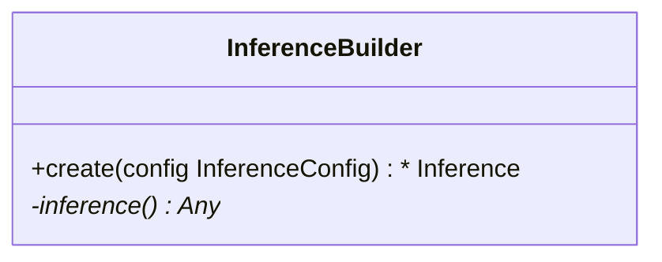

This tutorial can be downloaded as part of the [Wallaroo Tutorials repository](https://github.com/WallarooLabs/Wallaroo_Tutorials/tree/main/model_uploads/arbitrary-python-upload-tutorials).

## Wallaroo SDK Upload Arbitrary Python Tutorial: Generate Model

This tutorial demonstrates how to use arbitrary python as a ML Model in Wallaroo.  Arbitrary Python allows organizations to use Python scripts that require specific libraries and artifacts as models in the Wallaroo engine.  This allows for highly flexible use of ML models with supporting scripts.

### Tutorial Goals

This tutorial is split into two parts:

* **Wallaroo SDK Upload Arbitrary Python Tutorial: Generate Model**: Train a dummy `KMeans` model for clustering images using a pre-trained `VGG16` model on `cifar10` as a feature extractor.  The Python entry points used for Wallaroo deployment will be added and described.
  * A copy of the arbitrary Python model `models/model-auto-conversion-BYOP-vgg16-clustering.zip` is included in this tutorial, so this step can be skipped.
* **Arbitrary Python Tutorial Deploy Model in Wallaroo Upload and Deploy**: Deploys the `KMeans` model in an arbitrary Python package in Wallaroo, and perform sample inferences.  The file `models/model-auto-conversion-BYOP-vgg16-clustering.zip` is provided so users can go right to testing deployment.

Arbitrary Python models, also known as Bring Your Own Predict (BYOP) allow for custom model deployments with supporting scripts and artifacts.  These are used with pre-trained models (PyTorch, Tensorflow, etc) along with whatever supporting artifacts they require.  Supporting artifacts can include other Python modules, model files, etc.  These are zipped with all scripts, artifacts, and a `requirements.txt` file that indicates what other Python models need to be imported that are outside of the typical Wallaroo platform.

Contrast this with Wallaroo Python models - aka "Python steps".  These are standalone python scripts that use the python libraries natively supported by the Wallaroo platform.  These are used for either simple model deployment (such as ARIMA Statsmodels), or data formatting such as the postprocessing steps.  A Wallaroo Python model will be composed of one Python script that matches the Wallaroo requirements.

## Arbitrary Python File Requirements

Arbitrary Python (BYOP) models are uploaded to Wallaroo via a ZIP file with the following components:

| Artifact | Type | Description |
|---|---|---|
| Python scripts aka `.py` files with classes that extend `mac.inference.Inference` and `mac.inference.creation.InferenceBuilder` | Python Script | Extend the classes `mac.inference.Inference` and `mac.inference.creation.InferenceBuilder`.  These are included with the [Wallaroo SDK](https://docs.wallaroo.ai/wallaroo-developer-guides/wallaroo-sdk-guides/#data-type-conditions).  Further details are in [Arbitrary Python Script Requirements](https://docs.wallaroo.ai/wallaroo-developer-guides/wallaroo-sdk-guides/wallaroo-sdk-essentials-guide/wallaroo-sdk-model-uploads/wallaroo-sdk-model-arbitrary-python/).  Note that there is no specified naming requirements for the classes that extend `mac.inference.Inference` and `mac.inference.creation.InferenceBuilder` - any qualified class name is sufficient as long as these two classes are extended as defined below. |
| `requirements.txt` | Python requirements file | This sets the Python libraries used for the arbitrary python model.  These libraries should be targeted for Python 3.8 compliance.  **These requirements and the versions of libraries should be exactly the same between creating the model and deploying it in Wallaroo**.  This insures that the script and methods will function exactly the same as during the model creation process. |
| Other artifacts | Files | Other models, files, and other artifacts used in support of this model. |

For example, the if the arbitrary python model will be known as `vgg_clustering`, the contents may be in the following structure, with `vgg_clustering` as the storage directory:

```bash
vgg_clustering\
    feature_extractor.h5
    kmeans.pkl
    custom_inference.py
    requirements.txt
```

Note the inclusion of the `custom_inference.py` file.  This file name is **not** required - any Python script or scripts that extend the classes listed above are sufficient.  This Python script could have been named `vgg_custom_model.py` or any other name as long as it includes the extension of the classes listed above.

The sample arbitrary python model file is  created with the command `zip -r vgg_clustering.zip vgg_clustering/`.

Wallaroo Arbitrary Python uses the Wallaroo SDK `mac` module, included in the Wallaroo SDK 2023.2.1 and above.  See the [Wallaroo SDK Install Guides](https://docs.wallaroo.ai/wallaroo-developer-guides/wallaroo-sdk-guides/wallaroo-sdk-install-guides/) for instructions on installing the Wallaroo SDK.

### Arbitrary Python Script Requirements

The entry point of the arbitrary python model is *any* python script that extends the following classes.  These are included with the [Wallaroo SDK](https://docs.wallaroo.ai/wallaroo-developer-guides/wallaroo-sdk-guides/wallaroo-sdk-install-guides/).  The required methods that must be overridden are specified in each section below.

* `mac.inference.Inference` interface serves model inferences based on submitted input some input. Its purpose is to serve inferences for any supported arbitrary model framework (e.g. `scikit`, `keras` etc.).

  ```mermaid
  classDiagram
      class Inference {
          <<Abstract>>
          +model Optional[Any]
          +expected_model_types()* Set
          +predict(input_data: InferenceData)*  InferenceData
          -raise_error_if_model_is_not_assigned() None
          -raise_error_if_model_is_wrong_type() None
      }
  ```

* `mac.inference.creation.InferenceBuilder` builds a concrete `Inference`, i.e. instantiates an `Inference` object, loads the appropriate model and assigns the model to to the Inference object.

  ```mermaid
  classDiagram
      class InferenceBuilder {
          +create(config InferenceConfig) * Inference
          -inference()* Any
      }
  ```

### mac.inference.Inference

#### mac.inference.Inference Objects

| Object | Type | Description |
|---|---|---|
| `model Optional[Any]` | An optional list of models that match the supported frameworks from `wallaroo.framework.Framework` included in the arbitrary python script.  Note that this is **optional** - no models are actually required.  A BYOP can refer to a specific model(s) used, be used for data processing and reshaping for later pipeline steps, or other needs. |

#### mac.inference.Inference Methods

| Method | Returns | Description |
|---|---|---|
| `expected_model_types` (*Required*) | `Set` | Returns a Set of models expected for the inference.  The set of models must match the [Wallaroo supported model frameworks](https://docs.wallaroo.ai/wallaroo-developer-guides/wallaroo-sdk-guides/wallaroo-sdk-essentials-guide/wallaroo-sdk-model-uploads/).  Typically this is a set of one.  Wallaroo checks the expected model types to verify that the model submitted through the `InferenceBuilder` method matches what this `Inference` class expects. |
| `_predict (input_data: mac.types.InferenceData)` (*Required*) |  `mac.types.InferenceData` | The entry point for the Wallaroo inference with the following input and output parameters that are defined when the model is updated. <ul><li>`mac.types.InferenceData`: The **input** `InferenceData` is a dictionary of numpy arrays derived from the `input_schema` detailed when the model is uploaded, defined in PyArrow.Schema format.</li><li>`mac.types.InferenceData`:  The **output** is a dictionary of numpy arrays as defined by the output paraemters defined in PyArrow.Schema format.</li></ul>  The `InferenceDataValidationError` exception is raised when the input data does not match `mac.types.InferenceData`. |
| `raise_error_if_model_is_not_assigned` | N/A | Error when `expected_model_types` is not set. |
| `raise_error_if_model_is_wrong_type` | N/A | Error when the model does not match the `expected_model_types`. |

### mac.inference.creation.InferenceBuilder

`InferenceBuilder` builds a concrete `Inference`, i.e. instantiates an `Inference` object, loads the appropriate model and assigns the model to the Inference.



**Each model** that is included requires its own `InferenceBuilder`.  `InferenceBuilder` loads one model, then submits it to the `Inference` class when created.  The `Inference` class checks this class against its `expected_model_types()` Set.

#### mac.inference.creation.InferenceBuilder Methods

| Method | Returns | Description |
|---|---|---|
| `create(config mac.config.inference.CustomInferenceConfig)` (*Required*) |  The custom `Inference` instance. | Creates an Inference subclass, then assigns a model and attributes.  The `CustomInferenceConfig` is used to retrieve the `config.model_path`, which is a `pathlib.Path object` pointing to the folder where the model artifacts are saved.  **Every** artifact loaded must be relative to `config.model_path`.  This is set when the arbitrary python .zip file is uploaded and the environment for running it in Wallaroo is set.  For example:  loading the artifact `vgg_clustering\feature_extractor.h5` would be set with `config.model_path \ feature_extractor.h5`.  The model loaded must match an existing module.  For our example, this is `from sklearn.cluster import KMeans`, and this must match the `Inference` `expected_model_types`.  |
| `inference` | custom `Inference` instance. | Returns the instantiated custom Inference object created from the `create` method. |

## VGG16 Model Training Steps

This process will train a dummy `KMeans` model for clustering images using a pre-trained `VGG16` model on `cifar10` as a feature extractor.  This model consists of the following elements:

* All elements are stored in the folder `models/vgg16_clustering`.  This will be converted to the zip file `model-auto-conversion-BYOP-vgg16-clustering.zip`.
* `models/vgg16_clustering` will contain the following:
  * All necessary model artifacts
  * One or multiple Python files implementing the classes `Inference` and `InferenceBuilder`.  The implemented classes can have any naming they desire as long as they inherit from the appropriate base classes.
  * a `requirements.txt` file with all necessary pip requirements to successfully run the inference

### Import Libraries

The first step is to import the libraries we'll be using.  These are included by default in the Wallaroo instance's JupyterHub service.

```python
import numpy as np
import pandas as pd
import json
import os
import pickle
import pyarrow as pa
import tensorflow as tf
import warnings
warnings.filterwarnings('ignore')

from sklearn.cluster import KMeans
from tensorflow.keras.datasets import cifar10
from tensorflow.keras import Model
from tensorflow.keras.layers import Flatten
```

    2023-07-07 16:16:26.511340: W tensorflow/stream_executor/platform/default/dso_loader.cc:64] Could not load dynamic library 'libcudart.so.11.0'; dlerror: libcudart.so.11.0: cannot open shared object file: No such file or directory
    2023-07-07 16:16:26.511369: I tensorflow/stream_executor/cuda/cudart_stub.cc:29] Ignore above cudart dlerror if you do not have a GPU set up on your machine.

### Variables

We'll use these variables in later steps rather than hard code them in.  In this case, the directory where we'll store our artifacts.

```python
model_directory = './models/vgg16_clustering'
```

### Load Data Set

In this section, we will load our sample data and shape it.

```python
# Load and preprocess the CIFAR-10 dataset
(X_train, y_train), (X_test, y_test) = cifar10.load_data()

# Normalize the pixel values to be between 0 and 1
X_train = X_train / 255.0
X_test = X_test / 255.0
```

```python
X_train.shape
```

    (50000, 32, 32, 3)

### Train KMeans with VGG16 as feature extractor

Now we will train our model.

```python
pretrained_model = tf.keras.applications.VGG16(include_top=False, 
                                               weights='imagenet', 
                                               input_shape=(32, 32, 3)
                                               )
embedding_model = Model(inputs=pretrained_model.input, 
                        outputs=Flatten()(pretrained_model.output))
```

    2023-07-07 16:16:30.207936: W tensorflow/stream_executor/platform/default/dso_loader.cc:64] Could not load dynamic library 'libcuda.so.1'; dlerror: libcuda.so.1: cannot open shared object file: No such file or directory
    2023-07-07 16:16:30.207966: W tensorflow/stream_executor/cuda/cuda_driver.cc:269] failed call to cuInit: UNKNOWN ERROR (303)
    2023-07-07 16:16:30.207987: I tensorflow/stream_executor/cuda/cuda_diagnostics.cc:156] kernel driver does not appear to be running on this host (jupyter-john-2ehummel-40wallaroo-2eai): /proc/driver/nvidia/version does not exist
    2023-07-07 16:16:30.208169: I tensorflow/core/platform/cpu_feature_guard.cc:151] This TensorFlow binary is optimized with oneAPI Deep Neural Network Library (oneDNN) to use the following CPU instructions in performance-critical operations:  AVX2 AVX512F FMA
    To enable them in other operations, rebuild TensorFlow with the appropriate compiler flags.

```python
X_train_embeddings = embedding_model.predict(X_train[:100])
X_test_embeddings = embedding_model.predict(X_test[:100])
```

```python
kmeans = KMeans(n_clusters=2, random_state=0).fit(X_train_embeddings)
```

### Save Models

Let's first create the directory where the model artifacts will be saved:

```python
os.makedirs(model_directory, exist_ok=True)
```

And now save the two models:

```python
with  open(f'{model_directory}/kmeans.pkl', 'wb') as fp:
    pickle.dump(kmeans, fp)
```

```python
embedding_model.save(f'{model_directory}/feature_extractor.h5')
```

    WARNING:tensorflow:Compiled the loaded model, but the compiled metrics have yet to be built. `model.compile_metrics` will be empty until you train or evaluate the model.

All needed model artifacts have been now saved under our model directory.

### Sample Arbitrary Python Script

The following shows an example of extending the Inference and InferenceBuilder classes for our specific model.  This script is located in our model directory under `./models/vgg16_clustering`.

```python
"""This module features an example implementation of a custom Inference and its
corresponding InferenceBuilder."""

import pathlib
import pickle
from typing import Any, Set

import tensorflow as tf
from mac.config.inference import CustomInferenceConfig
from mac.inference import Inference
from mac.inference.creation import InferenceBuilder
from mac.types import InferenceData
from sklearn.cluster import KMeans

class ImageClustering(Inference):
    """Inference class for image clustering, that uses
    a pre-trained VGG16 model on cifar10 as a feature extractor
    and performs clustering on a trained KMeans model.

    Attributes:
        - feature_extractor: The embedding model we will use
        as a feature extractor (i.e. a trained VGG16).
        - expected_model_types: A set of model instance types that are expected by this inference.
        - model: The model on which the inference is calculated.
    """

    def __init__(self, feature_extractor: tf.keras.Model):
        self.feature_extractor = feature_extractor
        super().__init__()

    @property
    def expected_model_types(self) -> Set[Any]:
        return {KMeans}

    @Inference.model.setter  # type: ignore
    def model(self, model) -> None:
        """Sets the model on which the inference is calculated.

        :param model: A model instance on which the inference is calculated.

        :raises TypeError: If the model is not an instance of expected_model_types
            (i.e. KMeans).
        """
        self._raise_error_if_model_is_wrong_type(model) # this will make sure an error will be raised if the model is of wrong type
        self._model = model

    def _predict(self, input_data: InferenceData) -> InferenceData:
        """Calculates the inference on the given input data.
        This is the core function that each subclass needs to implement
        in order to calculate the inference.

        :param input_data: The input data on which the inference is calculated.
        It is of type InferenceData, meaning it comes as a dictionary of numpy
        arrays.

        :raises InferenceDataValidationError: If the input data is not valid.
        Ideally, every subclass should raise this error if the input data is not valid.

        :return: The output of the model, that is a dictionary of numpy arrays.
        """

        # input_data maps to the input_schema we have defined
        # with PyArrow, coming as a dictionary of numpy arrays
        inputs = input_data["images"]

        # Forward inputs to the models
        embeddings = self.feature_extractor(inputs)
        predictions = self.model.predict(embeddings.numpy())

        # Return predictions as dictionary of numpy arrays
        return {"predictions": predictions}

class ImageClusteringBuilder(InferenceBuilder):
    """InferenceBuilder subclass for ImageClustering, that loads
    a pre-trained VGG16 model on cifar10 as a feature extractor
    and a trained KMeans model, and creates an ImageClustering object."""

    @property
    def inference(self) -> ImageClustering:
        return ImageClustering

    def create(self, config: CustomInferenceConfig) -> ImageClustering:
        """Creates an Inference subclass and assigns a model and additionally
        needed attributes to it.

        :param config: Custom inference configuration. In particular, we're
        interested in `config.model_path` that is a pathlib.Path object
        pointing to the folder where the model artifacts are saved.
        Every artifact we need to load from this folder has to be
        relative to `config.model_path`.

        :return: A custom Inference instance.
        """
        feature_extractor = self._load_feature_extractor(
            config.model_path / "feature_extractor.h5"
        )
        inference = self.inference(feature_extractor)
        model = self._load_model(config.model_path / "kmeans.pkl")
        inference.model = model

        return inference

    def _load_feature_extractor(
        self, file_path: pathlib.Path
    ) -> tf.keras.Model:
        return tf.keras.models.load_model(file_path)

    def _load_model(self, file_path: pathlib.Path) -> KMeans:
        with open(file_path.as_posix(), "rb") as fp:
            model = pickle.load(fp)
        return model
```

### Create Requirements File

As a last step we need to create a `requirements.txt` file and save it under our `vgg_clustering/`. The file should contain all the necessary pip requirements needed to run the inference. It will have this data inside.

* **IMPORTANT NOTE**:  Verify that the library versions match the [required model versions and libraries for Wallaroo](https://docs.wallaroo.ai/wallaroo-developer-guides/wallaroo-sdk-guides/wallaroo-sdk-essentials-guide/wallaroo-sdk-model-uploads/).  Otherwise the deployed models 

```txt
tensorflow==2.8.0
scikit-learn==1.2.2
```

### Zip model folder

Assuming we have stored the following files inside out model directory `models/vgg_clustering/`:

1. `feature_extractor.h5`
1. `kmeans.pkl`
1. `custom_inference.py`
1. `requirements.txt`

Now we will zip the file.  This is performed with the `zip` command and the `-r` option to zip the contents of the entire directory.

`zip -r model-auto-conversion-BYOP-vgg16-clustering.zip vgg16_clustering/`

The arbitrary Python custom model can now be uploaded to the Wallaroo instance.
