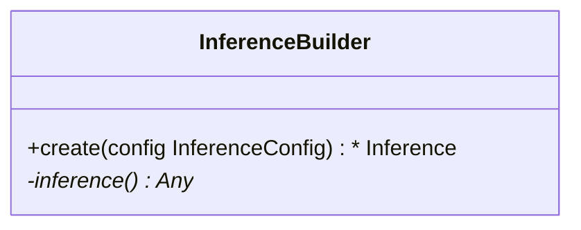

This tutorial can be downloaded as part of the [Wallaroo Tutorials repository](https://github.com/WallarooLabs/Wallaroo_Tutorials/tree/main/model_uploads/arbitrary-python-upload-tutorials).

## Arbitrary Python Tutorial Deploy Model in Wallaroo Upload and Deploy

This tutorial demonstrates how to use arbitrary python as a ML Model in Wallaroo.  Arbitrary Python allows organizations to use Python scripts that require specific libraries and artifacts as models in the Wallaroo engine.  This allows for highly flexible use of ML models with supporting scripts.

### Tutorial Prerequisites

* A Wallaroo version 2023.2.1 or above instance.

### References

* [Wallaroo SDK Essentials Guide: Model Uploads and Registrations: Arbitrary Python](https://docs.wallaroo.ai/wallaroo-developer-guides/wallaroo-sdk-guides/wallaroo-sdk-essentials-guide/wallaroo-sdk-model-uploads/wallaroo-sdk-model-arbitrary-python/)

Arbitrary Python models, also known as Bring Your Own Predict (BYOP) allow for custom model deployments with supporting scripts and artifacts.  These are used with pre-trained models (PyTorch, Tensorflow, etc) along with whatever supporting artifacts they require.  Supporting artifacts can include other Python modules, model files, etc.  These are zipped with all scripts, artifacts, and a `requirements.txt` file that indicates what other Python models need to be imported that are outside of the typical Wallaroo platform.

Contrast this with Wallaroo Python models - aka "Python steps".  These are standalone python scripts that use the python libraries natively supported by the Wallaroo platform.  These are used for either simple model deployment (such as ARIMA Statsmodels), or data formatting such as the postprocessing steps.  A Wallaroo Python model will be composed of one Python script that matches the Wallaroo requirements.

## Arbitrary Python File Requirements

Arbitrary Python (BYOP) models are uploaded to Wallaroo via a ZIP file with the following components:

| Artifact | Type | Description |
|---|---|---|
| Python scripts aka `.py` files with classes that extend `mac.inference.Inference` and `mac.inference.creation.InferenceBuilder` | Python Script | Extend the classes `mac.inference.Inference` and `mac.inference.creation.InferenceBuilder`.  These are included with the [Wallaroo SDK](https://docs.wallaroo.ai/wallaroo-developer-guides/wallaroo-sdk-guides/#data-type-conditions).  Further details are in [Arbitrary Python Script Requirements](https://docs.wallaroo.ai/wallaroo-developer-guides/wallaroo-sdk-guides/wallaroo-sdk-essentials-guide/wallaroo-sdk-model-uploads/wallaroo-sdk-model-arbitrary-python/).  Note that there is no specified naming requirements for the classes that extend `mac.inference.Inference` and `mac.inference.creation.InferenceBuilder` - any qualified class name is sufficient as long as these two classes are extended as defined below. |
| `requirements.txt` | Python requirements file | This sets the Python libraries used for the arbitrary python model.  These libraries should be targeted for Python 3.8 compliance.  **These requirements and the versions of libraries should be exactly the same between creating the model and deploying it in Wallaroo**.  This insures that the script and methods will function exactly the same as during the model creation process. |
| Other artifacts | Files | Other models, files, and other artifacts used in support of this model. |

For example, the if the arbitrary python model will be known as `vgg_clustering`, the contents may be in the following structure, with `vgg_clustering` as the storage directory:

```bash
vgg_clustering\
    feature_extractor.h5
    kmeans.pkl
    custom_inference.py
    requirements.txt
```

Note the inclusion of the `custom_inference.py` file.  This file name is **not** required - any Python script or scripts that extend the classes listed above are sufficient.  This Python script could have been named `vgg_custom_model.py` or any other name as long as it includes the extension of the classes listed above.

The sample arbitrary python model file is  created with the command `zip -r vgg_clustering.zip vgg_clustering/`.

Wallaroo Arbitrary Python uses the Wallaroo SDK `mac` module, included in the Wallaroo SDK 2023.2.1 and above.  See the [Wallaroo SDK Install Guides](https://docs.wallaroo.ai/wallaroo-developer-guides/wallaroo-sdk-guides/wallaroo-sdk-install-guides/) for instructions on installing the Wallaroo SDK.

### Arbitrary Python Script Requirements

The entry point of the arbitrary python model is *any* python script that extends the following classes.  These are included with the [Wallaroo SDK](https://docs.wallaroo.ai/wallaroo-developer-guides/wallaroo-sdk-guides/wallaroo-sdk-install-guides/).  The required methods that must be overridden are specified in each section below.

* `mac.inference.Inference` interface serves model inferences based on submitted input some input. Its purpose is to serve inferences for any supported arbitrary model framework (e.g. `scikit`, `keras` etc.).

  ```mermaid
  classDiagram
      class Inference {
          <<Abstract>>
          +model Optional[Any]
          +expected_model_types()* Set
          +predict(input_data: InferenceData)*  InferenceData
          -raise_error_if_model_is_not_assigned() None
          -raise_error_if_model_is_wrong_type() None
      }
  ```

* `mac.inference.creation.InferenceBuilder` builds a concrete `Inference`, i.e. instantiates an `Inference` object, loads the appropriate model and assigns the model to to the Inference object.

  ```mermaid
  classDiagram
      class InferenceBuilder {
          +create(config InferenceConfig) * Inference
          -inference()* Any
      }
  ```

### mac.inference.Inference

#### mac.inference.Inference Objects

| Object | Type | Description |
|---|---|---|
| `model Optional[Any]` | An optional list of models that match the supported frameworks from `wallaroo.framework.Framework` included in the arbitrary python script.  Note that this is **optional** - no models are actually required.  A BYOP can refer to a specific model(s) used, be used for data processing and reshaping for later pipeline steps, or other needs. |

#### mac.inference.Inference Methods

| Method | Returns | Description |
|---|---|---|
| `expected_model_types` (*Required*) | `Set` | Returns a Set of models expected for the inference as defined by the developer.  Typically this is a set of one.  Wallaroo checks the expected model types to verify that the model submitted through the `InferenceBuilder` method matches what this `Inference` class expects. |
| `_predict (input_data: mac.types.InferenceData)` (*Required*) |  `mac.types.InferenceData` | The entry point for the Wallaroo inference with the following input and output parameters that are defined when the model is updated. <ul><li>`mac.types.InferenceData`: The **input** `InferenceData` is a dictionary of numpy arrays derived from the `input_schema` detailed when the model is uploaded, defined in PyArrow.Schema format.</li><li>`mac.types.InferenceData`:  The **output** is a dictionary of numpy arrays as defined by the output paraemters defined in PyArrow.Schema format.</li></ul>  The `InferenceDataValidationError` exception is raised when the input data does not match `mac.types.InferenceData`. |
| `raise_error_if_model_is_not_assigned` | N/A | Error when `expected_model_types` is not set. |
| `raise_error_if_model_is_wrong_type` | N/A | Error when the model does not match the `expected_model_types`. |

### mac.inference.creation.InferenceBuilder

`InferenceBuilder` builds a concrete `Inference`, i.e. instantiates an `Inference` object, loads the appropriate model and assigns the model to the Inference.



**Each model** that is included requires its own `InferenceBuilder`.  `InferenceBuilder` loads one model, then submits it to the `Inference` class when created.  The `Inference` class checks this class against its `expected_model_types()` Set.

#### mac.inference.creation.InferenceBuilder Methods

| Method | Returns | Description |
|---|---|---|
| `create(config mac.config.inference.CustomInferenceConfig)` (*Required*) |  The custom `Inference` instance. | Creates an Inference subclass, then assigns a model and attributes.  The `CustomInferenceConfig` is used to retrieve the `config.model_path`, which is a `pathlib.Path object` pointing to the folder where the model artifacts are saved.  **Every** artifact loaded must be relative to `config.model_path`.  This is set when the arbitrary python .zip file is uploaded and the environment for running it in Wallaroo is set.  For example:  loading the artifact `vgg_clustering\feature_extractor.h5` would be set with `config.model_path \ feature_extractor.h5`.  The model loaded must match an existing module.  For our example, this is `from sklearn.cluster import KMeans`, and this must match the `Inference` `expected_model_types`.  |
| `inference` | custom `Inference` instance. | Returns the instantiated custom Inference object created from the `create` method. |

## Tutorial Steps

### Import Libraries

The first step is to import the libraries we'll be using.  These are included by default in the Wallaroo instance's JupyterHub service.

```python
import numpy as np
import pandas as pd
import json
import os
import pickle
import pyarrow as pa
import tensorflow as tf
import wallaroo
from wallaroo.object import EntityNotFoundError

from sklearn.cluster import KMeans
from tensorflow.keras.datasets import cifar10
from tensorflow.keras import Model
from tensorflow.keras.layers import Flatten
from wallaroo.pipeline   import Pipeline
from wallaroo.deployment_config import DeploymentConfigBuilder
from wallaroo.framework import Framework
```

    2023-09-18 14:57:12.681704: W tensorflow/stream_executor/platform/default/dso_loader.cc:64] Could not load dynamic library 'libcudart.so.11.0'; dlerror: libcudart.so.11.0: cannot open shared object file: No such file or directory
    2023-09-18 14:57:12.681746: I tensorflow/stream_executor/cuda/cudart_stub.cc:29] Ignore above cudart dlerror if you do not have a GPU set up on your machine.

### Open a Connection to Wallaroo

The next step is connect to Wallaroo through the Wallaroo client.  The Python library is included in the Wallaroo install and available through the Jupyter Hub interface provided with your Wallaroo environment.

This is accomplished using the `wallaroo.Client()` command, which provides a URL to grant the SDK permission to your specific Wallaroo environment.  When displayed, enter the URL into a browser and confirm permissions.  Store the connection into a variable that can be referenced later.

If logging into the Wallaroo instance through the internal JupyterHub service, use `wl = wallaroo.Client()`.  If logging in externally, update the `wallarooPrefix` and `wallarooSuffix` variables with the proper DNS information.  For more information on Wallaroo DNS settings, see the [Wallaroo DNS Integration Guide](https://docs.wallaroo.ai/wallaroo-operations-guide/wallaroo-configuration/wallaroo-dns-guide/).

```python
wl = wallaroo.Client()

```

### Set Variables and Helper Functions

We'll set the name of our workspace, pipeline, models and files.  Workspace names must be unique across the Wallaroo workspace.  For this, we'll add in a randomly generated 4 characters to the workspace name to prevent collisions with other users' workspaces.  If running this tutorial, we recommend hard coding the workspace name so it will function in the same workspace each time it's run.

We'll set up some helper functions that will either use existing workspaces and pipelines, or create them if they do not already exist.

```python
import string
import random

# make a random 4 character suffix to prevent overwriting other user's workspaces
suffix= ''.join(random.choice(string.ascii_lowercase) for i in range(4))

workspace_name = f'vgg16-clustering-workspace{suffix}'
pipeline_name = f'vgg16-clustering-pipeline'

model_name = 'arm-vgg16-clustering'
model_file_name = './models/model-auto-conversion-BYOP-vgg16-clustering_arm.zip'
```

```python
def get_workspace(name):
    workspace = None
    for ws in wl.list_workspaces():
        if ws.name() == name:
            workspace= ws
    if(workspace == None):
        workspace = wl.create_workspace(name)
    return workspace

def get_pipeline(name):
    try:
        pipeline = wl.pipelines_by_name(name)[0]
    except EntityNotFoundError:
        pipeline = wl.build_pipeline(name)
    return pipeline
```

### Create Workspace and Pipeline

We will now create the Wallaroo workspace to store our model and set it as the current workspace.  Future commands will default to this workspace for pipeline creation, model uploads, etc.  We'll create our Wallaroo pipeline that is used to deploy our arbitrary Python model.

```python
workspace = get_workspace(workspace_name)
wl.set_current_workspace(workspace)

pipeline = get_pipeline(pipeline_name)
```

### Upload Arbitrary Python Model

Arbitrary Python models are uploaded to Wallaroo through the Wallaroo Client `upload_model` method.

#### Upload Arbitrary Python Model Parameters

The following parameters are required for Arbitrary Python models.  Note that while some fields are considered as **optional** for the `upload_model` method, they are required for proper uploading of a Arbitrary Python model to Wallaroo.

| Parameter | Type | Description |
|---|---|---|
|`name` | `string` (*Required*) | The name of the model.  Model names are unique per workspace.  Models that are uploaded with the same name are assigned as a new **version** of the model. |
|`path` | `string` (*Required*) | The path to the model file being uploaded. |
|`framework` |`string` (*Upload Method Optional, Arbitrary Python model Required*) | Set as `Framework.CUSTOM`. |
|`input_schema` | `pyarrow.lib.Schema` (*Upload Method Optional, Arbitrary Python model Required*) | The input schema in Apache Arrow schema format. |
|`output_schema` | `pyarrow.lib.Schema` (*Upload Method Optional, Arbitrary Python model Required*) | The output schema in Apache Arrow schema format. |
| `convert_wait` | `bool` (*Upload Method Optional, Arbitrary Python model Optional*) (*Default: True*) | <ul><li>**True**: Waits in the script for the model conversion completion.</li><li>**False**:  Proceeds with the script without waiting for the model conversion process to display complete. |

Once the upload process starts, the model is containerized by the Wallaroo instance.  This process may take up to 10 minutes.

#### Upload Arbitrary Python Model Return

The following is returned with a successful model upload and conversion.

| Field | Type | Description |
|---|---|---|
| `name` | string | The name of the model. |
| `version` | string | The model version as a unique UUID. |
| `file_name` | string | The file name of the model as stored in Wallaroo. |
| `image_path` | string | The image used to deploy the model in the Wallaroo engine. |
| `last_update_time` | DateTime | When the model was last updated. |

For our example, we'll start with setting the `input_schema` and `output_schema` that is expected by our `ImageClustering._predict()` method.

```python
input_schema = pa.schema([
    pa.field('images', pa.list_(
        pa.list_(
            pa.list_(
                pa.int64(),
                list_size=3
            ),
            list_size=32
        ),
        list_size=32
    )),
])

output_schema = pa.schema([
    pa.field('predictions', pa.int64()),
])
```

### Upload Model

Now we'll upload our model.  The framework is `Framework.CUSTOM` for arbitrary Python models, and we'll specify the input and output schemas for the upload.

An important note for the ARM version of the VGG16 model is verifying that the Python modules used will operate in an ARM environment.  For example, the x86 model has the following as its `requirements.txt`:

```python
tensorflow==2.8.0
scikit-learn==1.2.2
```

The ARM version replaces the `tensorflow` module with the `tensorflow-aarch64` that runs in the ARM archtecture.  Otherwise, the model and Python script is the same.

```python
tensorflow-aarch64==2.8.4
scikit-learn==1.2.2
```

```python
from wallaroo.engine_config import Architecture

model = wl.upload_model(model_name, 
                        model_file_name, 
                        framework=Framework.CUSTOM, 
                        input_schema=input_schema, 
                        output_schema=output_schema,
                        arch=Architecture.ARM, 
                        convert_wait=True)
model
```

    Waiting for model loading - this will take up to 10.0min.
    Model is pending loading to a container runtime..
    Model is attempting loading to a container runtime.......................successful
    
    Ready

<table>
        <tr>
          <td>Name</td>
          <td>arm-vgg16-clustering</td>
        </tr>
        <tr>
          <td>Version</td>
          <td>14f9929d-cb37-4e44-aacd-2120b349ef31</td>
        </tr>
        <tr>
          <td>File Name</td>
          <td>model-auto-conversion-BYOP-vgg16-clustering_arm.zip</td>
        </tr>
        <tr>
          <td>SHA</td>
          <td>e53d1775766567eda5fd7ecb1618ea073fc18ffd6298c75da67be3b704029f15</td>
        </tr>
        <tr>
          <td>Status</td>
          <td>ready</td>
        </tr>
        <tr>
          <td>Image Path</td>
          <td>proxy.replicated.com/proxy/wallaroo/ghcr.io/wallaroolabs/mlflow-deploy:v2023.4.0-main-3827</td>
        </tr>
        <tr>
          <td>Updated At</td>
          <td>2023-18-Sep 14:59:39</td>
        </tr>
      </table>

```python
print(model)
```

    {'name': 'arm-vgg16-clustering', 'version': '14f9929d-cb37-4e44-aacd-2120b349ef31', 'file_name': 'model-auto-conversion-BYOP-vgg16-clustering_arm.zip', 'image_path': 'proxy.replicated.com/proxy/wallaroo/ghcr.io/wallaroolabs/mlflow-deploy:v2023.4.0-main-3827', 'last_update_time': datetime.datetime(2023, 9, 18, 14, 59, 39, 729445, tzinfo=tzutc())}

### Deploy Pipeline

The model is uploaded and ready for use.  We'll add it as a step in our pipeline, then deploy the pipeline.  For this example we're allocated 0.25 cpu and 4 Gi RAM to the pipeline through the pipeline's deployment configuration.

```python
pipeline.add_model_step(model)
```

<table><tr><th>name</th> <td>vgg16-clustering-pipeline</td></tr><tr><th>created</th> <td>2023-09-18 14:57:31.537378+00:00</td></tr><tr><th>last_updated</th> <td>2023-09-18 14:57:31.537378+00:00</td></tr><tr><th>deployed</th> <td>(none)</td></tr><tr><th>tags</th> <td></td></tr><tr><th>versions</th> <td>d42d5272-86dd-414b-8928-6dea07c866c1</td></tr><tr><th>steps</th> <td></td></tr><tr><th>published</th> <td>False</td></tr></table>

```python
deployment_config = DeploymentConfigBuilder() \
    .cpus(1).memory('4Gi') \
    .build()

pipeline.deploy(deployment_config=deployment_config)
pipeline.status()
```

    Waiting for deployment - this will take up to 90s ........................ ok

    {'status': 'Running',
     'details': [],
     'engines': [{'ip': '10.244.2.13',
       'name': 'engine-d665b9c7d-jhr7s',
       'status': 'Running',
       'reason': None,
       'details': [],
       'pipeline_statuses': {'pipelines': [{'id': 'vgg16-clustering-pipeline',
          'status': 'Running'}]},
       'model_statuses': {'models': [{'name': 'arm-vgg16-clustering',
          'version': '14f9929d-cb37-4e44-aacd-2120b349ef31',
          'sha': 'e53d1775766567eda5fd7ecb1618ea073fc18ffd6298c75da67be3b704029f15',
          'status': 'Running'}]}}],
     'engine_lbs': [{'ip': '10.244.3.39',
       'name': 'engine-lb-584f54c899-ksj6c',
       'status': 'Running',
       'reason': None,
       'details': []}],
     'sidekicks': [{'ip': '10.244.0.40',
       'name': 'engine-sidekick-arm-vgg16-clustering-2-6f5975c9f6-6dgct',
       'status': 'Running',
       'reason': None,
       'details': [],
       'statuses': '\n'}]}

### Run inference

Everything is in place - we'll now run a sample inference with some toy data.  In this case we're randomly generating some values in the data shape the model expects, then submitting an inference request through our deployed pipeline.

```python
input_data = {
        "images": [np.random.randint(0, 256, (32, 32, 3), dtype=np.uint8)] * 2,
}
dataframe = pd.DataFrame(input_data)
dataframe
```

<table border="1" class="dataframe">
  <thead>
    <tr style="text-align: right;">
      <th></th>
      <th>images</th>
    </tr>
  </thead>
  <tbody>
    <tr>
      <th>0</th>
      <td>[[[142, 30, 10], [182, 46, 219], [233, 142, 22...</td>
    </tr>
    <tr>
      <th>1</th>
      <td>[[[142, 30, 10], [182, 46, 219], [233, 142, 22...</td>
    </tr>
  </tbody>
</table>

```python
pipeline.infer(dataframe, timeout=10000)
```

<table border="1" class="dataframe">
  <thead>
    <tr style="text-align: right;">
      <th></th>
      <th>time</th>
      <th>in.images</th>
      <th>out.predictions</th>
      <th>check_failures</th>
    </tr>
  </thead>
  <tbody>
    <tr>
      <th>0</th>
      <td>2023-09-18 15:00:07.019</td>
      <td>[142, 30, 10, 182, 46, 219, 233, 142, 223, 94,...</td>
      <td>1</td>
      <td>0</td>
    </tr>
    <tr>
      <th>1</th>
      <td>2023-09-18 15:00:07.019</td>
      <td>[142, 30, 10, 182, 46, 219, 233, 142, 223, 94,...</td>
      <td>1</td>
      <td>0</td>
    </tr>
  </tbody>
</table>

### Undeploy Pipelines

The inference is successful, so we will undeploy the pipeline and return the resources back to the cluster.

```python
pipeline.undeploy()
```

    Waiting for undeployment - this will take up to 45s .................................... ok

<table><tr><th>name</th> <td>vgg16-clustering-pipeline</td></tr><tr><th>created</th> <td>2023-09-18 14:57:31.537378+00:00</td></tr><tr><th>last_updated</th> <td>2023-09-18 14:59:40.816423+00:00</td></tr><tr><th>deployed</th> <td>False</td></tr><tr><th>tags</th> <td></td></tr><tr><th>versions</th> <td>65299c7d-79dd-477e-b54e-adb0239f60eb, d42d5272-86dd-414b-8928-6dea07c866c1</td></tr><tr><th>steps</th> <td>arm-vgg16-clustering</td></tr><tr><th>published</th> <td>False</td></tr></table>

