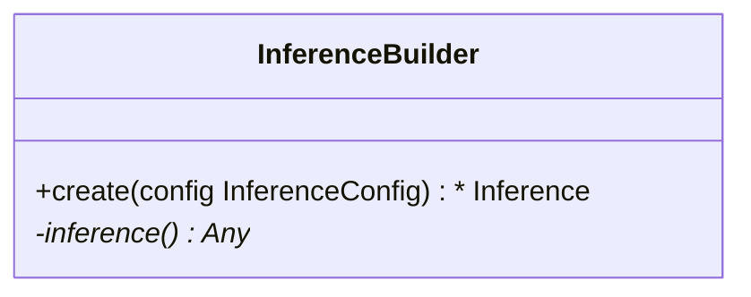

## Arbitrary Python File Requirements

Arbitrary Python (BYOP) models are uploaded to Wallaroo via a ZIP file with the following components:

| Artifact | Type | Description |
|---|---|---|
| Python scripts aka `.py` files with classes that extend `mac.inference.Inference` and `mac.inference.creation.InferenceBuilder` | Python Script | Extend the classes `mac.inference.Inference` and `mac.inference.creation.InferenceBuilder`.  These are included with the [Wallaroo SDK](https://docs.wallaroo.ai/wallaroo-developer-guides/wallaroo-sdk-guides/#data-type-conditions).  Further details are in [Arbitrary Python Script Requirements](https://docs.wallaroo.ai/wallaroo-developer-guides/wallaroo-sdk-guides/wallaroo-sdk-essentials-guide/wallaroo-sdk-model-uploads/wallaroo-sdk-model-arbitrary-python/).  Note that there is no specified naming requirements for the classes that extend `mac.inference.Inference` and `mac.inference.creation.InferenceBuilder` - any qualified class name is sufficient as long as these two classes are extended as defined below. |
| `requirements.txt` | Python requirements file | This sets the Python libraries used for the arbitrary python model.  These libraries should be targeted for Python 3.8 compliance.  **These requirements and the versions of libraries should be exactly the same between creating the model and deploying it in Wallaroo**.  This insures that the script and methods will function exactly the same as during the model creation process. |
| Other artifacts | Files | Other models, files, and other artifacts used in support of this model. |

For example, the if the arbitrary python model will be known as `vgg_clustering`, the contents may be in the following structure, with `vgg_clustering` as the storage directory:

```bash
vgg_clustering\
    feature_extractor.h5
    kmeans.pkl
    custom_inference.py
    requirements.txt
```

Note the inclusion of the `custom_inference.py` file.  This file name is **not** required - any Python script or scripts that extend the classes listed above are sufficient.  This Python script could have been named `vgg_custom_model.py` or any other name as long as it includes the extension of the classes listed above.

The sample arbitrary python model file is  created with the command `zip -r vgg_clustering.zip vgg_clustering/`.

Wallaroo Arbitrary Python uses the Wallaroo SDK `mac` module, included in the Wallaroo SDK 2023.2.1 and above.  See the [Wallaroo SDK Install Guides](https://docs.wallaroo.ai/wallaroo-developer-guides/wallaroo-sdk-guides/wallaroo-sdk-install-guides/) for instructions on installing the Wallaroo SDK.

### Arbitrary Python Script Requirements

The entry point of the arbitrary python model is *any* python script that extends the following classes.  These are included with the [Wallaroo SDK](https://docs.wallaroo.ai/wallaroo-developer-guides/wallaroo-sdk-guides/wallaroo-sdk-install-guides/).  The required methods that must be overridden are specified in each section below.

* `mac.inference.Inference` interface serves model inferences based on submitted input some input. Its purpose is to serve inferences for any supported arbitrary model framework (e.g. `scikit`, `keras` etc.).

  ```mermaid
  classDiagram
      class Inference {
          <<Abstract>>
          +model Optional[Any]
          +expected_model_types()* Set
          +predict(input_data: InferenceData)*  InferenceData
          -raise_error_if_model_is_not_assigned() None
          -raise_error_if_model_is_wrong_type() None
      }
  ```

* `mac.inference.creation.InferenceBuilder` builds a concrete `Inference`, i.e. instantiates an `Inference` object, loads the appropriate model and assigns the model to to the Inference object.

  ```mermaid
  classDiagram
      class InferenceBuilder {
          +create(config InferenceConfig) * Inference
          -inference()* Any
      }
  ```

### mac.inference.Inference

#### mac.inference.Inference Objects

| Object | Type | Description |
|---|---|---|
| `model Optional[Any]` | An optional list of models that match the supported frameworks from `wallaroo.framework.Framework` included in the arbitrary python script.  Note that this is **optional** - no models are actually required.  A BYOP can refer to a specific model(s) used, be used for data processing and reshaping for later pipeline steps, or other needs. |

#### mac.inference.Inference Methods

| Method | Returns | Description |
|---|---|---|
| `expected_model_types` (*Required*) | `Set` | Returns a Set of models expected for the inference.  The set of models must match the [Wallaroo supported model frameworks](https://docs.wallaroo.ai/wallaroo-developer-guides/wallaroo-sdk-guides/wallaroo-sdk-essentials-guide/wallaroo-sdk-model-uploads/).  Typically this is a set of one.  Wallaroo checks the expected model types to verify that the model submitted through the `InferenceBuilder` method matches what this `Inference` class expects. |
| `_predict (input_data: mac.types.InferenceData)` (*Required*) |  `mac.types.InferenceData` | The entry point for the Wallaroo inference with the following input and output parameters that are defined when the model is updated. <ul><li>`mac.types.InferenceData`: The **input** `InferenceData` is a dictionary of numpy arrays derived from the `input_schema` detailed when the model is uploaded, defined in PyArrow.Schema format.</li><li>`mac.types.InferenceData`:  The **output** is a dictionary of numpy arrays as defined by the output paraemters defined in PyArrow.Schema format.</li></ul>  The `InferenceDataValidationError` exception is raised when the input data does not match `mac.types.InferenceData`. |
| `raise_error_if_model_is_not_assigned` | N/A | Error when `expected_model_types` is not set. |
| `raise_error_if_model_is_wrong_type` | N/A | Error when the model does not match the `expected_model_types`. |

### mac.inference.creation.InferenceBuilder

`InferenceBuilder` builds a concrete `Inference`, i.e. instantiates an `Inference` object, loads the appropriate model and assigns the model to the Inference.



**Each model** that is included requires its own `InferenceBuilder`.  `InferenceBuilder` loads one model, then submits it to the `Inference` class when created.  The `Inference` class checks this class against its `expected_model_types()` Set.

#### mac.inference.creation.InferenceBuilder Methods

| Method | Returns | Description |
|---|---|---|
| `create(config mac.config.inference.CustomInferenceConfig)` (*Required*) |  The custom `Inference` instance. | Creates an Inference subclass, then assigns a model and attributes.  The `CustomInferenceConfig` is used to retrieve the `config.model_path`, which is a `pathlib.Path object` pointing to the folder where the model artifacts are saved.  **Every** artifact loaded must be relative to `config.model_path`.  This is set when the arbitrary python .zip file is uploaded and the environment for running it in Wallaroo is set.  For example:  loading the artifact `vgg_clustering\feature_extractor.h5` would be set with `config.model_path \ feature_extractor.h5`.  The model loaded must match an existing module.  For our example, this is `from sklearn.cluster import KMeans`, and this must match the `Inference` `expected_model_types`.  |
| `inference` | custom `Inference` instance. | Returns the instantiated custom Inference object created from the `create` method. |
